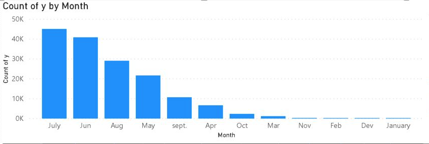
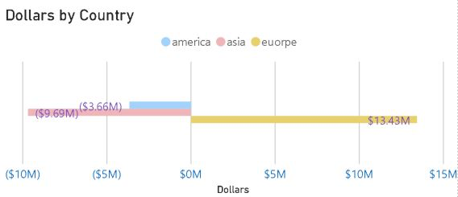
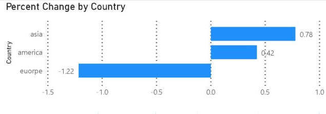
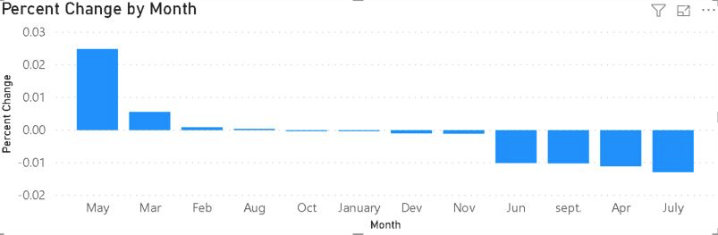
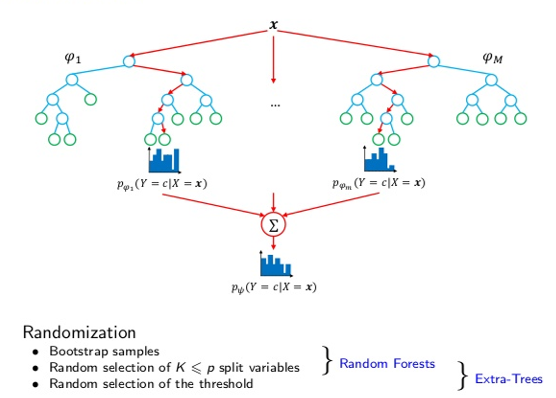

```{r setup, include=FALSE}

library(rmdformats)    # for html formattinglibrary(tidyverse) # data wrangling
library(tidyverse)     # data manipulaiton
library(modelr)        # factor manipulation
library(skimr)         # data exploration
library(na.tools)      # for mean imputation
library(ggplot2)       # visualization
library(reshape2)      # wide / long for visualization
library(corrplot)      # visualisation
library(VIM)           # missing values
#library(vip)
#library(car) # modeling
library(glmnet)        # logistic regression
library(caret)         # model training & hyperparameter tuning
library(ROCR)          # model validation
library(MASS)          # model validation
library(ranger)        # modeling Random Forest
library(e1071)         # modeling Random Forest tuning
library(neuralnet)     # forward feed neural net

knitr::opts_chunk$set(echo = TRUE,
               prompt = FALSE,
               tidy = TRUE,
               comment = NA,
               message = FALSE,
               warning = FALSE)
```

***
# Cost Analysis of an Unknown Dataset
***
Martin Garcia, Michael Catalano, Jeremy Otsap, Christian Nava  
August 12, 2020  


## Introduction
***

We have been presented with a dataset of 160,000 rows and 51 columns. The columns are labeled y, and x0 through x49. The objective is to predict the values of the target variable, y, which has values of 0 and 1. False positives have a cost of \$10 each and false negatives have a cost of \$500 each. True positives and true negatives have a cost of $0.


```{r}
# loading data file from Azure Blob Storage as it exceeds the size threshold for github
final.df <- read.csv("https://modisdatawu2sqlml01.blob.core.windows.net/smu-data/ds7333/final_project.csv", header = T)
```


```{r}
#examine data
str(final.df)
summary(final.df)
```


## Data Exploration

An initial review of the data reveals all but five variables are numeric. The remaining variables are categorical and can be most aptly described or labled as country (x24), month (x29), day_of_the_week (x30). Variables x32 and x37 appear to be a percentage change and a dollar amount, respectively. These are being mislabeled as factor variables due to the $ and % characters. In order to correctly analyze these columns we converted these to numeric values.

```{r}
# convert percentage factor to numeric
as.numeric(gsub("\\%","",final.df$x32)) -> final.df$x32

# convert dollar factor to numeric
as.numeric(gsub("\\$","",final.df$x37)) -> final.df$x37

# validate x32 and x37 are now numeric
str(final.df[,c(33,38)])
```

We used PowerBI to perform some data exploration and get a sense of the data. We found that the response variable is sensitive to summer months as can be seen in Figure 1.

<h4 align="center">Figure 1: Percent Change by Month</h4>  

<center>

</center>  


Additionally, most of the dollar value appears to come from Europe as can be seen in Figure 2. Whether that dollar value is an expense or revenue is unclear.  

<h4 align="center">Figure 2: Dollars by Country</h4> 

<center>

</center>


When we look at percent change by country, we see the largest percent change comes from Europe as shown is Figure 3. 

<h4 align="center">Figure 3: Percent Change by Country</h4> 

<center>

</center>  

Also, the largest percentage changes tend to occur during the summer months as shown in Figure 4.  


<center>

</center>

An initial inspection leads us to believe variable x37, which is a dollar amount, may be an influential variable.

## Missing Data: Imputation Method

We find that all columns except for the categorial columns have observations with missing values.

```{r}
# check variables for missing values
sapply(final.df, function(x) sum(is.na(x))) 
```

A visualizaiton of the missing data shows that each column has its own unique set of missing values, which do not align to other columns/parameters. Dropping rows with missing variables, or using listwise deletion, would delete an entire row for that column's one missing value. 

```{r}
# visualize missing data
aggr(final.df, 
     prop = FALSE, 
     combined = TRUE, 
     numbers = TRUE, 
     sortVars = TRUE, 
     sortCombs = TRUE)
```


### Listwise Deletion

Given that many variables have observations with missing values, a listwise deletion approach would maximize data loss, resulting in 1,520 deleted rows, or approximately 0.95% data loss.
```{r}
# output number of missing rows
print("total number of deleted rows: ")
print(dim(final.df)[1] - dim(na.omit(final.df))[1] )

# apply listwise deletion to new dataframe
final_impute.df <- na.omit(final.df)

print( "The percentage difference for listwise deletion is: "  )
print( (nrow(final.df)-nrow(final_impute.df))/nrow(final.df) )
```


### Final Imputation Approach

Wee used a hybrid approach of mean substituion and listwise deletion for data imputation. Missing categorical observations would be dropped and missing numerical values would be replaced with the mean value of the variable.

We confirmed there were no missing values on the categorical columns x24, x29, and x30, which do not require an imputation method.

```{r}
# output number of remaining rows after applying listwise deletion
print("total number of missing rows in X24: ")
sum(is.na(final.df$x24))

print("total number of missing rows in X29: ")
sum(is.na(final.df$x29))

print("total number of missing rows in X30: ")
sum(is.na(final.df$x30))
```


We than used mean subsitutionn for the missing numerical values.

```{r}
# create new dataframe
final.df -> final_msub.df

# loop through na.mean
loop_length <- length(final_msub.df)

for (i in c(1:24,26:29,32:51) ) {
  na.mean(final_msub.df[,i]) -> final_msub.df[,i]
  i = i + 1
}

```


We then verified new imputed dataframe had no missing values and the factor data types had not changed.

```{r}
# verify x24, x29, and x30 are still categorical
str(final_msub.df[,c(25, 30, 31)])

# verify all missing values have been imputd
sapply(final_msub.df, function(x) sum(is.na(x))) 
```

A visualization of the data gives us additional confirmation of that the missing data has been replaced.
```{r}
# visualize missing data
aggr(final_msub.df, 
     prop = FALSE, 
     combined = TRUE, 
     numbers = TRUE, 
     sortVars = TRUE, 
     sortCombs = TRUE)
```


## Data Visualization

Using a box plot of each variable, we can see that variable x37 has a much larger range than the other variables. Variable x37 was a dollar ammount. 
```{r, echo=FALSE}

ggplot(data = melt(final_msub.df), aes(x=variable, y=value)) + geom_boxplot(aes(fill=variable)) + coord_flip()
```

To bring this variable's value within range of the other variables we can perform scaling and centering, or we can divide by 1,000 to represent thousands of dollars. We chose to divide variable x37's value by 1,000.
```{r}
# compare range of x37 raw and divided by 1000
summary(final_msub.df$x37)
summary((final_msub.df$x37)/1000)

```

The data has now been prepared for modeling and analysis.

## Performance Metric: AUC Score

The metric used for this project is the area under the Receiver Operating Characteristic curve (AUC). The Receiver Operating Characteristic curve (ROC) graphs the performance of a classification model at all classification thresholds; it plots the true positive rate (TPR) against the false positive rate (FPR) as shown in Figure 1.

<h4 align="center">Figure 1: Area Under the Reciever Operating Curve</h4> 

<center>

<center>

<h4 align="center">Source: [Journal of Thoracic and Cardiovascular Surgery](https://www.jtcvs.org/article/S0022-5223(18)32875-7/fulltext)</h4>

Each curve represents the graph of a single model. Movement along the curve indicates changing the threshold used for classifying a positive instance. The area under the ROC curve measures the two-dimensional area under the ROC curve and is given by the integral of the curve, or the area under the curve (AUC): $$AUC = \int_{0}^{1}TPR(x)dx = \int_{0}^{1}P(A>\tau (x))dx$$

where $x$ is the false positive rate and $A$ is the distribution of scores the model produces for data points that are actually in the positive class.

This metric is measured between 0 and 1. A higher score indicates a better model. Visually, a superior model will graph as a curve above and to the left of another curve. A straight diagonal line beginning at 0 on the bottom left and ending at 1 on the top right indicates a naive model (random guessing).


## Outline of Approach
A logistic regression model was used as a baseline, or benchmark, model and the results were then compared to those from an untuned random forest model, a tuned random forest model,  and a feed-forward neural network model, and a feed-forward neural network model using the most important variables as per the random forest model. 


## Model 1: Logistic Regression

Logistic regression is a method to estimate the probability of a binary response based on one or more independent variables. It aims to model the conditional probabilty $P(Y=1|X=x)\,$ as a function of $x$. The probabilities, however, must be bounded by $0$ and $1$. To acheive this, a logistic (or logit) transformation, $\;log\frac{p(x)}{1-p(x)}$, is applied [1]. The resulting regression model takes on the form $$log\frac{p(x)}{1-p(x)}=\beta{_0}+\beta{_x}\cdot{x}$$ where $1-p(x)\,$ is the probability that $Y=0$, $\;p(x)$ is the probability that $Y=1$, $\;\beta{_0}$ is the intercept from the linear regression equation, $\;\beta{_x}$is the regression coefficient, and $x$ is an independent variable (predictor). Misclassification is minimized by predicting $Y=1$ when $\,p\geq0.5\,$, and $Y=0\,$ when $p\leq0.5\;$ (i.e., choosing $1$ when $\beta{_0}+\beta{_x}\cdot{x}\;$ is non-negative and $0$ otherwise).

We used the caret package, and for the caret package to properly process binomial classification models, the response must be categorical binary.

```{r}

# categorize y 
final_msub.df <- final_msub.df %>% mutate(y = factor(y) )

```

We begin by creating a training and test set. There is a slight imbalance in the response variable, and we want to ensure that the sampled proportion of positive and negative classes in the data set is represented in the training and test sets. 

```{r}
# plot classes for y variable
#final.df %>% 
 # ggplot(aes(x=y)) + 
  #geom_col()
```

The `caret` package automatically does this by splitting the sample into groups sections based on percentiles and sampling is done within these subgroups.

```{r}
set.seed(123)
# creating the 80 data partition 
final_split <- createDataPartition(final_msub.df$y, p = 0.8, list = F)
# including 80 for training set
final_train.df <- final_msub.df[final_split,] 
# excluding 80 for testing set
final_test.df <- final_msub.df[-final_split,]
# validating
dim(final_test.df)
dim(final_train.df)

```

Here confirm that the ratio of postive and negative classes in the response variable is maintained the the sample for the training and test sets. The ratio positive (1) to negative (0) classes for the entire dataset is 64,197 / 95,803 = 0.6700. For the test set the ratio is 12,814 / 19,186 = 0.6678 and the ratio for the training set is 51,383 / 76,617 = 0.6704. 
```{r}
# compare level split of main data frame
table(final_msub.df$y)

# validating sample maintained ratio for response levels
table(final_test.df$y)
table(final_train.df$y)

```


### Baseline Model

For the baseline model, we did not tune any hyperparameters or perform feature selection.

```{r}
# create logistic regression model on train data
# R will automatically create dummy variables on factors
ptm <- proc.time()
final_train.logit <- glm(y ~ ., data = final_train.df, family = binomial("logit") )
summary(final_train.logit)
proc.time() - ptm

```


Visualizing the coefficients of the full logistic model, we can see the most influential variables are x32, x29January, and x24america.


```{r fig.height=10,fig.width=8}
# visualize coefficients
as.data.frame(final_train.logit$coefficients) %>% 
  ggplot(aes(y = .[,1], x = rownames(.)) ) + geom_bar(stat = 'identity') + coord_flip() + ylab("Importance") + xlab("") + ggtitle("Variable Importance") + guides(fill=F) + scale_fill_gradient(low="gray", high="blue")
```

#### ROC Curve for Full Logistic Model

We validate the accuracy of our model on the test data set by looking at a AUC score for the model. The AUC is 0.7608, which is a better benchmark that random guessing or luck (AUC = 0.50).

```{r}
# create predictions
predict(
  final_train.logit, 
  newdata = final_test.df,
  type = "response"
  ) -> final_logit.pred

# ROC curve
performance(
  ROCR::prediction(final_logit.pred, final_test.df$y),
  measure = "tpr",
  x.measure = "fpr"
) -> final_logit.perf 

plot(final_logit.perf)

# AUC value
print("AUC Value for this model is ")
performance(
  ROCR::prediction(final_logit.pred, final_test.df$y),
  measure = "auc"
)@y.values[[1]]
```


#### Confusion Matrix

To ensure we correctly interpret the confusion matrix we explicity specify 1 as the reference and positive class. Additionally, we coerced the probabilities to either be 1 or 0 based on a 50% threshold. The confusion matrix will let us know how many observations were correctly classified as either 0 or 1. It will also indicate how many obervations were incorrectly classified as positives (false positives) and how many were incorrectly classified as negatives (false negatives).

```{r}
# split into "1" and "0" factors based on 0.5 thresdshold
as.numeric(final_logit.pred > 0.5 ) %>% as.factor() -> final_logit_factor.pred

```


From the confusion matrix we can see that the logistic model has 6,135 false negatives and 3,372 false positives. Since each false positive incurrs a cost of \$10 and each false negative costs \$500, the total cost of false positives and false negatives is \$3,101,220 for the baseline model.

A specificity of 0.82 and sensitivity of 0.52 indicates that this model does a better job of predicting the 0, the negative class, and has almost a 50-50 probability of predicting 1, the positive class.

```{r}
# confusion matrix
caret::confusionMatrix(
  data = relevel(final_logit_factor.pred, ref = "1"),
  reference = relevel(final_test.df$y , ref = "1")
)
```


## Model 2: Random Forest Model

The random forest model is an ensemble method of learning for classification and is more powerful than logistic regression. The random forest model groups a set of decision trees and then it predicts based on the majority of votes (when used for classification) or aggregation (when used for regression) from each of the decision trees made.

<center>

</center>
<center>
<br>
**Figure 1**: Random Forest Model  
Source: [KDNuggets](https://www.kdnuggets.com/2017/10/random-forests-explained.html)
</center>
<br>
This ensemble method is based on randomization where each tree in the forest is built randomly with the same distribution. Each tree is trained in isolation. The basic procedure for the algorithm involves the following steps illustrated above.  

1. Select $\varphi{_M}$ bootstrap samples from the training data, $\chi$. 
2. For each of the bootstrap samples $\varphi{_M}$, grow an unpruned classification or regression tree to the largest extent possible (i.e., split the node into two daughter nodes until the minimum node size is reached).
3. Predict new data by aggregating the predictions of the $\varphi{_M}$ trees. These predictions can be assembled into a probability distribution, whose mode (i.e., majority votes for classification) or average (i.e., aggregation for regression) yields the random forest’s proposed rating $p_{\psi}(Y=c|X=\chi)$.

We used the `ranger` package to fit the random forest as opposed to the default `rpart` algorithms or `randomForest` package due to it's significantly faster C++ implementation that allows for multi-threaded processing.

```{r}
ptm <- proc.time()

# default mtry for classification is sqrt(# of features)
mtry_final <- floor(sqrt(ncol(final_train.df)))
#tuneGrid = expand.grid(mtry = c(4,5,6))

# training RF model

ranger(
  y ~ .,
  data = final_train.df,
  mtry = mtry_final,
  respect.unordered.factors = "order",
  importance = "permutation", # "impurity",
  verbose = T,
  seed = 665
) -> final_train.rf

proc.time() - ptm

```


Model Hyperparameters for the random forest model include:

* **mtry** How many random variables should be included in each tree?
* **min.node.size** What is minimum depth of each tree before a split can occur?
* **splitrule** What is the criteria to split trees? [i.e. to minimize node impurity]


The `ranger` defaults for the random forest model have not been changed for this model and are listed below:

* mtry for Classification: sqrt(# of predictors) ~7 in this case
* mtry for Regression: (# of predictors) / 3
* min.node.size: 1 for classification or 5 for regression
* splitrule: "gini" for classification or SSE for regression


```{r}
# confusion matrix on TRAINING data
final_train.rf$confusion.matrix

# best tuning parameters
print("Final model's mtry: ")
print(final_train.rf$mtry)

print("Final model's min.node.size: ")
final_train.rf$min.node.size

print("Final model's num.trees: ")
final_train.rf$num.trees

print("Final model's splitrule: ")
final_train.rf$splitrule

print("Final model's variable importance mode: ")
final_train.rf$importance.mode


```


The random forest model shows an improvement on the baseline logistic regression model in terms of AUC score. The random forest model has an AUC score of 0.920 compared to an AUC score of 0.761 for the logistic regression model.

```{r}
# predictions
predict(
  final_train.rf,
  data = final_test.df,
  ) -> final_forest.pred


# AUC plot
# NOTE: must convert values to numeric to use function
performance(
  ROCR::prediction( as.numeric(final_forest.pred$predictions),
              as.numeric(final_test.df$y) ),
  measure = "tpr",
  x.measure = "fpr"
) -> final_forest.perf 
plot(final_forest.perf)

# AUC value
print("AUC Value for this model is ")
performance(
  ROCR::prediction( as.numeric(final_forest.pred$predictions),
              as.numeric(final_test.df$y) ),
  measure = "auc",
  )@y.values[[1]] 
```


The confusion matrix for the random forest model shows 786 false positives yeilding a cost of \$7,860 and 1,515 false negatives yeilding a cost of \$757,500 or a total cost of \$765,360. Additionally, we can see there was a significant improvement in the sensitivity and specificity scores, implying this model does a better job of predicting both the positve and negative classes than the logistic regression model.

```{r}
# confusion matrix
caret::confusionMatrix(
  data = relevel(final_forest.pred$predictions, ref = "1"),
  reference = relevel(final_test.df$y , ref = "1")
)
```


When we look at the variable importance plot, which tells us which variables have the largest effect on the model, we see that variables x23, x49, x20, x48, x42, x37, x12, x40, x27, x6, x2, x28, x41, x38, x7, x46, and x32 have the highest importance.

```{r fig.height=10,fig.width=10}
# variable importance plot
final_ranger_imp.df <- as.data.frame(final_train.rf$variable.importance)

# rownames
final_ranger_imp.df$x_label <- rownames(final_ranger_imp.df )

# rename column
names(final_ranger_imp.df)[1] <- "x_value"

# ggplot
ggplot(final_ranger_imp.df, aes(x=reorder(x_label,x_value), y=x_value,fill=x_value)) + geom_bar(stat = 'identity') + coord_flip() + ylab("Importance") + xlab("") + ggtitle("Variable Importance") + guides(fill=F) + scale_fill_gradient(low="gray", high="blue")

```


## Model 3: Tuned Random Forest Model

As per above, there are a number of hyperparameters that can be optimized to improve model performance. We use `caret` as the training engine to optimize Ranger's hyperparameters as well as executing the 5-fold cross-validation and normalizing the data.

We set the tuning grid as follows
* attempt **mtry** values of 5,6, and 7
* attempt **min.node.size** values of 1 and 2
* attempt all 3 different types of **splitrule** values: "gini", "extratrees", "hellinger" Additionally 

Given the higher cost of false negatives we set the target metric to specificity, rather than the default, accuracy. Specificity measures a model's abilty to predict true negatives, i.e., when the class is actually negative, how often does the model correctly identify the negative class?  If the model was attempting to correctly identify those without cancer, how often did it correctly predict that a patient did not have cancer?

We also set the importance from the default impurity to permutation. Permutation importance is more reliable, albeit more computationally expensive than mean decrease in impurity. The basic idea is to consider a variable important if it has a positive effect on the prediction accuracy (classification), or MSE (regression). This metric is applicable to any model, not just random forests. The risk of using this metric is a potential bias towards collinear predictive variables.

Also reduced the number of trees to 300 from default of 500.


```{r}

#################################
### TUNED RANDOM FOREST MODEL ###
#################################

# cluster preparation for parallel CPU
library(parallel)
library(doParallel)
cluster <- makeCluster(detectCores() - 1) # leave 1 core for OS
registerDoParallel(cluster)

# start timer to check how long code takes to run
ptm <- proc.time()

# training grid
trainControl(
  method = "cv",
  number = 5,
  summaryFunction = twoClassSummary, 
  savePredictions = "final", 
  classProbs = F, 
  verboseIter = T,
  search = "random",
  allowParallel = T
  ) -> final_caret.grid

# tuning grid

final_tune.grid <- expand.grid( 
  mtry = 7, 
  splitrule = "extratrees", 
  min.node.size = 2)

# training RF model
train(
  y ~ .,
  data = final_train.df,
  method = "ranger",
  trControl = final_caret.grid, 
  num.threads = (detectCores() - 1),
  preProcess = c("scale","center"),
  tuneGrid = final_tune.grid,
  num.trees = 300,
  importance = 'permutation', #'impurity',
  metric = "Spec" # "Accuracy" or "Sens"
) -> final_train.caret

# end timer
proc.time() - ptm

### SHUTDOWN CLUSTER
stopCluster(cluster)
#registerDoSEQ()

```


```{r}
# best tuning parameter
final_train.caret$bestTune

#final model
final_train.caret$finalModel

# predictions
predict(final_train.caret, final_test.df) -> final_caret.pred
```

The AUC score for the tuned random forest model is 0.8933556.


```{r}
# AUC plot
# NOTE: must convert values to numeric to use function
performance(
  ROCR::prediction( as.numeric(final_caret.pred), 
              as.numeric(final_test.df$y)
              ),
  measure = "tpr",
  x.measure = "fpr"
) -> final_caret.perf 
plot(final_caret.perf)

# AUC value
print("AUC Value for this model is ")
performance(
  ROCR::prediction( as.numeric(final_caret.pred),
              as.numeric(final_test.df$y) ),
  measure = "auc",
  )@y.values[[1]] 

```


Per the confusion matrix, the tuned random forest model yielded 2,201 false negatives and 802 false positives, for a total cost of \$1,108,520. Specifity is 0.9581, which implies that it is correctly classifying the negative class 95.81% of the time.

```{r}
# confusion matrix
caret::confusionMatrix(
  data = relevel(final_caret.pred, ref = "1"),
  reference = relevel(final_test.df$y , ref = "1")
)
```


The variable importance plot for the tuned random forest model shows that the top ___ most important variables are: 

```{r fig.height=10,fig.width=10}

# sexier importance plot
final_caret_imp.df <- as.data.frame(final_train.caret$finalModel$variable.importance)

#rownames
final_caret_imp.df$x_label <- rownames(final_caret_imp.df)

#rename column
names(final_caret_imp.df)[1] <- "x_value"


#ggplot
ggplot(final_caret_imp.df, aes(x=reorder(x_label,x_value), y=x_value,fill=x_value)) + geom_bar(stat = 'identity') + coord_flip() + ylab("Importance") + xlab("") + ggtitle("Variable Importance") + guides(fill=F) + scale_fill_gradient(low="gray", high="blue")


```


## Model 4: Forward Feed Neural Network (FFNN)

```{r}

#################################
### FULL MODEL: ALL VARIABLES ###
#################################

# cluster preparation for parallel CPU
library(parallel)
library(doParallel)
cluster <- makeCluster(detectCores() - 1) # leave 1 core for OS
registerDoParallel(cluster)

ptm <- proc.time()

# training grid
nn.grid <- expand.grid(size = c(8,8), decay = c(0.05))

trainControl(
  method = "cv", 
  number = 5,
  summaryFunction = twoClassSummary,
  allowParallel = T,
  classProbs = F, 
  verboseIter = T, 
  search = "random"
  ) -> full_nnet.grid


### NOTE: the standard formula syntax of "y ~ ." is not accepted in the neuralnet() function 
## Must first create formula object then pass it to neuralnet() function

train_names <- names(final_train.df)
train_formula_nn <- as.formula(paste("y ~", paste(train_names[!train_names %in% "y"], collapse = " + ")))

# training NNET model
train(train_formula_nn,
  data = final_train.df,
  method = "nnet",
  metric = "Spec",  # "Accuracy",  # "ROC", 
  trControl = full_nnet.grid, 
  num.threads = (detectCores() - 1),
  preProcess = "scale",
  tuneGrid = nn.grid
) -> full_train.nnet

proc.time() - ptm

### SHUTDOWN CLUSTER
stopCluster(cluster)
#registerDoSEQ()

```


The AUC score for the FFNN model model is 0.8287071, which is less desirable than either of the two random forest models above.

```{r}
# predictions
predict(full_train.nnet, final_test.df) -> full_nnet.pred

# AUC plot
# NOTE: must convert values to numeric to use function
performance(
  ROCR::prediction( 
    as.numeric(full_nnet.pred), 
    as.numeric(final_test.df$y) 
    ),
  measure = "tpr",
  x.measure = "fpr"
) -> full_nnet.perf 
plot(full_nnet.perf)

# AUC value
print("AUC Value for this model is ")
performance(
  ROCR::prediction( 
    as.numeric(full_nnet.pred), 
    as.numeric(final_test.df$y) 
    ),
  measure = "auc",
  )@y.values[[1]] 
```

Per the confusion matrix, the FFNN model yielded 2,614 false negatives and 2,663 false positives, for a total cost of \$1,333,630.

```{r}
# confusion matrix
caret::confusionMatrix(
  data = relevel(full_nnet.pred, ref = "1"),
  reference = relevel(final_test.df$y, ref = "1")
)
```


## Model 5: Forward Feed Neural Network - Important Variables

For this variation of the FFNN model we used only the most important variables as per the `ranger` random forest model.

```{r}

###############################################
### FFNN w/IMPORTANT VARIABLES FROM RANGER ###
##############################################


# cluster preparation for parallel CPU
library(parallel)
library(doParallel)
cluster <- makeCluster(detectCores() - 1) # leave 1 core for OS
registerDoParallel(cluster)

ptm <- proc.time()

# training grid
nn.grid <- expand.grid(size = c(7,7), decay = c(0.01))

trainControl(
  method = "cv", 
  number = 5,
  summaryFunction = twoClassSummary,
  allowParallel = T,
  classProbs = F, 
  verboseIter = T, 
  search = "random"
  ) -> final_nnet.grid

# formula
train_formula <- as.formula(y ~ x23 + x49 + x20 + x48 + x42 + x37 + x12 + x40 + x27 + x6 + x2 + x28 + x41 + x38 + x7 + x46 + x32)

# training NNET model
train(train_formula,
  data = final_train.df,
  method = "nnet",
  metric = "Spec",  # "ROC", 
  trControl = final_nnet.grid, 
  num.threads = (detectCores() - 1),
  preProcess = "scale",
  tuneGrid = nn.grid
) -> final_train.nnet

proc.time() - ptm

### SHUTDOWN CLUSTER
stopCluster(cluster)
#registerDoSEQ()

```

The AUC score for the FFNN model with important variables is 0.8469703.

```{r}
# evaluate model with test predictions
predict(final_train.nnet, final_test.df) -> final_nnet.pred

# AUC plot
# NOTE: must convert values to numeric to use function
performance(
  ROCR::prediction( 
    as.numeric(final_nnet.pred), 
    as.numeric(final_test.df$y) 
    ),
  measure = "tpr",
  x.measure = "fpr"
) -> final_nnet.perf 
plot(final_nnet.perf)

# AUC value
print("AUC Value for this model is ")
performance(
  ROCR::prediction( 
    as.numeric(final_nnet.pred), 
    as.numeric(final_test.df$y) 
    ),
  measure = "auc",
  )@y.values[[1]] 

```

Per the confusion matrix, the FFNN model using the most important variables yielded 2,529 false negatives and 2,090 false positives, for a total cost of \$1,285,400, which is a $48,200 improvement over the full FFNN model.

```{r}
# confusion matrix
caret::confusionMatrix(
  data = relevel(final_nnet.pred, ref = "1"),
  reference = relevel(final_test.df$y, ref = "1")
)
```


## Conclusion

The out-of-the box random forest model performed the best in terms of AUC score and was the most cost efficient of the five models. Additionally, the time to train this model is approximately 10 minutes, which is slightly slower than the logistic regression model (5.38 seconds); however, the cost savings far outweigh the additional training time evdn when compared to the rest of the models, depending on how often the model is expected to be updated and re-trained. 


Table 1: Model Performance

|         Model         |      AUC Score    | Training Time (in seconds)  | Total Cost ($USD)   | 
|:--------------------: | :----------------:| :--------------------------:| :------------------:|
| Logistic Regression	  |         0.7608    |             5.38            |      3,067,500      |
| Random Forest	        |         0.9205    |           592.98            |        757,500      |
| Random Forest (tuned) |         0.8934    |          1937.16            |      1,100,500      |
| FFNN (full model)	    |         0.8287    |           258.48            |      1,307,000      |
| FFNN (reduced model)	|         0.8470    |           100.68            |      1,264,500      |


