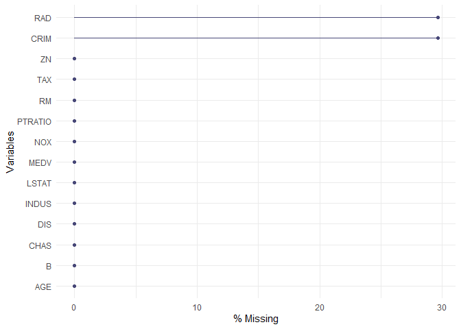

## Boston Data Set 

Using the Boston Housing Data Set examine the effect on loss for data Missing Completely at Random for 10% 20% and 50% of the data. Repeat the analysis for Missing at random and Missing Not at random. 


## Initial Data Exploration

**Data Description**

The Boston data frame has 506 rows and 14 columns.

This data frame contains the following columns:
  
* CRIM - per capita crime rate by town
* ZN - proportion of residential land zoned for lots over 25,000 sq.ft.
* INDUS - proportion of non-retail business acres per town.
* CHAS - Charles River dummy variable (1 if tract bounds river; 0 otherwise)
* NOX - nitric oxides concentration (parts per 10 million)
* RM - average number of rooms per dwelling
* AGE - proportion of owner-occupied units built prior to 1940
* DIS - weighted distances to five Boston employment centres
* RAD - index of accessibility to radial highways
* TAX - full-value property-tax rate per $10,000
* PTRATIO - pupil-teacher ratio by town
* B - 1000(Bk - 0.63)^2 where Bk is the proportion of blacks by town
* LSTAT - % lower status of the population
* MEDV - Median value of owner-occupied homes in $1000's


**Data Exploration**

The dataset reflects numeric values both integer and float type data. 


```
## 'data.frame':	506 obs. of  14 variables:
##  $ CRIM   : num  0.00632 0.02731 0.02729 0.03237 0.06905 ...
##  $ ZN     : num  18 0 0 0 0 0 12.5 12.5 12.5 12.5 ...
##  $ INDUS  : num  2.31 7.07 7.07 2.18 2.18 2.18 7.87 7.87 7.87 7.87 ...
##  $ CHAS   : int  0 0 0 0 0 0 0 0 0 0 ...
##  $ NOX    : num  0.538 0.469 0.469 0.458 0.458 0.458 0.524 0.524 0.524 0.524 ...
##  $ RM     : num  6.58 6.42 7.18 7 7.15 ...
##  $ AGE    : num  65.2 78.9 61.1 45.8 54.2 58.7 66.6 96.1 100 85.9 ...
##  $ DIS    : num  4.09 4.97 4.97 6.06 6.06 ...
##  $ RAD    : int  1 2 2 3 3 3 5 5 5 5 ...
##  $ TAX    : int  296 242 242 222 222 222 311 311 311 311 ...
##  $ PTRATIO: num  15.3 17.8 17.8 18.7 18.7 18.7 15.2 15.2 15.2 15.2 ...
##  $ B      : num  397 397 393 395 397 ...
##  $ LSTAT  : num  4.98 9.14 4.03 2.94 5.33 ...
##  $ MEDV   : num  24 21.6 34.7 33.4 36.2 28.7 22.9 27.1 16.5 18.9 ...
```

```
##       CRIM                ZN             INDUS            CHAS        
##  Min.   : 0.00632   Min.   :  0.00   Min.   : 0.46   Min.   :0.00000  
##  1st Qu.: 0.08204   1st Qu.:  0.00   1st Qu.: 5.19   1st Qu.:0.00000  
##  Median : 0.25651   Median :  0.00   Median : 9.69   Median :0.00000  
##  Mean   : 3.61352   Mean   : 11.36   Mean   :11.14   Mean   :0.06917  
##  3rd Qu.: 3.67708   3rd Qu.: 12.50   3rd Qu.:18.10   3rd Qu.:0.00000  
##  Max.   :88.97620   Max.   :100.00   Max.   :27.74   Max.   :1.00000  
##       NOX               RM             AGE              DIS        
##  Min.   :0.3850   Min.   :3.561   Min.   :  2.90   Min.   : 1.130  
##  1st Qu.:0.4490   1st Qu.:5.886   1st Qu.: 45.02   1st Qu.: 2.100  
##  Median :0.5380   Median :6.208   Median : 77.50   Median : 3.207  
##  Mean   :0.5547   Mean   :6.285   Mean   : 68.57   Mean   : 3.795  
##  3rd Qu.:0.6240   3rd Qu.:6.623   3rd Qu.: 94.08   3rd Qu.: 5.188  
##  Max.   :0.8710   Max.   :8.780   Max.   :100.00   Max.   :12.127  
##       RAD              TAX           PTRATIO            B         
##  Min.   : 1.000   Min.   :187.0   Min.   :12.60   Min.   :  0.32  
##  1st Qu.: 4.000   1st Qu.:279.0   1st Qu.:17.40   1st Qu.:375.38  
##  Median : 5.000   Median :330.0   Median :19.05   Median :391.44  
##  Mean   : 9.549   Mean   :408.2   Mean   :18.46   Mean   :356.67  
##  3rd Qu.:24.000   3rd Qu.:666.0   3rd Qu.:20.20   3rd Qu.:396.23  
##  Max.   :24.000   Max.   :711.0   Max.   :22.00   Max.   :396.90  
##      LSTAT            MEDV      
##  Min.   : 1.73   Min.   : 5.00  
##  1st Qu.: 6.95   1st Qu.:17.02  
##  Median :11.36   Median :21.20  
##  Mean   :12.65   Mean   :22.53  
##  3rd Qu.:16.95   3rd Qu.:25.00  
##  Max.   :37.97   Max.   :50.00
```


Skim allows a quick visual examination of each variable's range


Table: Data summary

                                     
-------------------------  ----------
Name                       boston.df 
Number of rows             506       
Number of columns          14        
_______________________              
Column type frequency:               
numeric                    14        
________________________             
Group variables            None      
-------------------------  ----------


**Variable type: numeric**

skim_variable    n_missing   complete_rate     mean       sd       p0      p25      p50      p75     p100  hist  
--------------  ----------  --------------  -------  -------  -------  -------  -------  -------  -------  ------
CRIM                     0               1     3.61     8.60     0.01     0.08     0.26     3.68    88.98  ▇▁▁▁▁ 
ZN                       0               1    11.36    23.32     0.00     0.00     0.00    12.50   100.00  ▇▁▁▁▁ 
INDUS                    0               1    11.14     6.86     0.46     5.19     9.69    18.10    27.74  ▇▆▁▇▁ 
CHAS                     0               1     0.07     0.25     0.00     0.00     0.00     0.00     1.00  ▇▁▁▁▁ 
NOX                      0               1     0.55     0.12     0.38     0.45     0.54     0.62     0.87  ▇▇▆▅▁ 
RM                       0               1     6.28     0.70     3.56     5.89     6.21     6.62     8.78  ▁▂▇▂▁ 
AGE                      0               1    68.57    28.15     2.90    45.02    77.50    94.07   100.00  ▂▂▂▃▇ 
DIS                      0               1     3.80     2.11     1.13     2.10     3.21     5.19    12.13  ▇▅▂▁▁ 
RAD                      0               1     9.55     8.71     1.00     4.00     5.00    24.00    24.00  ▇▂▁▁▃ 
TAX                      0               1   408.24   168.54   187.00   279.00   330.00   666.00   711.00  ▇▇▃▁▇ 
PTRATIO                  0               1    18.46     2.16    12.60    17.40    19.05    20.20    22.00  ▁▃▅▅▇ 
B                        0               1   356.67    91.29     0.32   375.38   391.44   396.23   396.90  ▁▁▁▁▇ 
LSTAT                    0               1    12.65     7.14     1.73     6.95    11.36    16.96    37.97  ▇▇▅▂▁ 
MEDV                     0               1    22.53     9.20     5.00    17.02    21.20    25.00    50.00  ▂▇▅▁▁ 


**Data Visualization**


```
## No id variables; using all as measure variables
```

<!-- -->


```r
boston_cor<-cor(boston.df)
corrplot(boston_cor, method="color")
```

<!-- -->

**Missing Data**

No missing values found in our initial Boston data set as validated below.

<!-- -->

```
## 
##  Variables sorted by number of missings: 
##  Variable Count
##      CRIM     0
##        ZN     0
##     INDUS     0
##      CHAS     0
##       NOX     0
##        RM     0
##       AGE     0
##       DIS     0
##       RAD     0
##       TAX     0
##   PTRATIO     0
##         B     0
##     LSTAT     0
##      MEDV     0
```


## Initial Regression Model

We are doing a regression on full data set, predicting MEDV, the median value of owner-occupied homes, using the other 13 parameters.


**Exclude vs Omit**

Using na.exclude pads the residuals and fitted values with NAs where there were missing values. Other functions do not use the na.action, but instead have a different argument (with some default) for how they will handle missing values. For example, the mean command will, by default, return NA if there are any NAs in the passed object. The example below creates a threshold to measure the effect of different imputations.


```
## 
## Call:
## lm(formula = MEDV ~ ., data = boston.df, na.action = na.omit)
## 
## Residuals:
##     Min      1Q  Median      3Q     Max 
## -15.595  -2.730  -0.518   1.777  26.199 
## 
## Coefficients:
##               Estimate Std. Error t value Pr(>|t|)    
## (Intercept)  3.646e+01  5.103e+00   7.144 3.28e-12 ***
## CRIM        -1.080e-01  3.286e-02  -3.287 0.001087 ** 
## ZN           4.642e-02  1.373e-02   3.382 0.000778 ***
## INDUS        2.056e-02  6.150e-02   0.334 0.738288    
## CHAS         2.687e+00  8.616e-01   3.118 0.001925 ** 
## NOX         -1.777e+01  3.820e+00  -4.651 4.25e-06 ***
## RM           3.810e+00  4.179e-01   9.116  < 2e-16 ***
## AGE          6.922e-04  1.321e-02   0.052 0.958229    
## DIS         -1.476e+00  1.995e-01  -7.398 6.01e-13 ***
## RAD          3.060e-01  6.635e-02   4.613 5.07e-06 ***
## TAX         -1.233e-02  3.760e-03  -3.280 0.001112 ** 
## PTRATIO     -9.527e-01  1.308e-01  -7.283 1.31e-12 ***
## B            9.312e-03  2.686e-03   3.467 0.000573 ***
## LSTAT       -5.248e-01  5.072e-02 -10.347  < 2e-16 ***
## ---
## Signif. codes:  0 '***' 0.001 '**' 0.01 '*' 0.05 '.' 0.1 ' ' 1
## 
## Residual standard error: 4.745 on 492 degrees of freedom
## Multiple R-squared:  0.7406,	Adjusted R-squared:  0.7338 
## F-statistic: 108.1 on 13 and 492 DF,  p-value: < 2.2e-16
```

```
## [1] "SSE for model is: "
```

```
## [1] 11078.78
```

```
## [1] "MSE for model is: "
```

```
## [1] 21.89483
```


**RESULTS**

Improvements for different imputation methods can be measured with various statistics. Adjusted R-square or coefficient of determination can help us assess the models overall quality. Adjusted R-squared value would help us explain the proportion of variance of median house prices with the given predictor variables while also penalizing for large number of predictors. Fitting a linear regression model without imputation results in a R-square of .7338, which means roughly 73.4% of the MEDV response variable is accounted for by the other 13 predictors. The accuracy of the model can be captured by looking at our residuals or actual median house prices minus predicted house prices. The baseline model results in a total sum of square errors of 11078. The goal will be to have a large R-square and small sum of squares error value. These results reflect the effect of listwise deletion on data missing completely at random (MCAR).

<center>
The Sum of Squares Error [SSE] for model is: <b>11078.78</b>

The Mean Square Error [MSE] for model is: <b>21.89483</b>

Adjusted R-squared: <b>.7338</b>
</center>

NOTE: Because AGE and INDUS were found to not be statistically significant we will *not* use those for the missing data exercises


## MCAR

First generate vector of *unique* random numbers to correspond to each percentage

* 1% - 5 entries
* 5% - 25 entries
* 10% - 51 entries
* 20% - 102 entries
* 33% - 168 entries
* 50% - 253 entries 


**Value to be Deleted**
* PTRATIO - pupil-teacher ratio by town


Create vector to serve as sample index for creating NA values


**Create different boston samples with NA for PTRATIO**

We visualize the prorportion of missing value sets ranging from 1% to 50%, with their corresponding volume.

1% - 5 entries 


```
## [1] NA NA NA NA NA
```

<!-- -->

```
## 
##  Variables sorted by number of missings: 
##  Variable Count
##   PTRATIO     5
##      CRIM     0
##        ZN     0
##     INDUS     0
##      CHAS     0
##       NOX     0
##        RM     0
##       AGE     0
##       DIS     0
##       RAD     0
##       TAX     0
##         B     0
##     LSTAT     0
##      MEDV     0
```


5% - 25 entries


```
## [1] NA NA NA NA NA NA
```

<!-- -->

```
## 
##  Variables sorted by number of missings: 
##  Variable Count
##   PTRATIO    25
##      CRIM     0
##        ZN     0
##     INDUS     0
##      CHAS     0
##       NOX     0
##        RM     0
##       AGE     0
##       DIS     0
##       RAD     0
##       TAX     0
##         B     0
##     LSTAT     0
##      MEDV     0
```


10% - 51 entries


```
## [1] NA NA NA NA NA NA
```

<!-- -->

```
## 
##  Variables sorted by number of missings: 
##  Variable Count
##   PTRATIO    51
##      CRIM     0
##        ZN     0
##     INDUS     0
##      CHAS     0
##       NOX     0
##        RM     0
##       AGE     0
##       DIS     0
##       RAD     0
##       TAX     0
##         B     0
##     LSTAT     0
##      MEDV     0
```


20% - 102 entries


```
## [1] NA NA NA NA NA NA
```

<!-- -->

```
## 
##  Variables sorted by number of missings: 
##  Variable Count
##   PTRATIO   102
##      CRIM     0
##        ZN     0
##     INDUS     0
##      CHAS     0
##       NOX     0
##        RM     0
##       AGE     0
##       DIS     0
##       RAD     0
##       TAX     0
##         B     0
##     LSTAT     0
##      MEDV     0
```


33% - 168 entries


```
## [1] NA NA NA NA NA NA
```

<!-- -->

```
## 
##  Variables sorted by number of missings: 
##  Variable Count
##   PTRATIO   168
##      CRIM     0
##        ZN     0
##     INDUS     0
##      CHAS     0
##       NOX     0
##        RM     0
##       AGE     0
##       DIS     0
##       RAD     0
##       TAX     0
##         B     0
##     LSTAT     0
##      MEDV     0
```


50% - 253 entries


```
## [1] NA NA NA NA NA NA
```

<!-- -->

```
## 
##  Variables sorted by number of missings: 
##  Variable Count
##   PTRATIO   253
##      CRIM     0
##        ZN     0
##     INDUS     0
##      CHAS     0
##       NOX     0
##        RM     0
##       AGE     0
##       DIS     0
##       RAD     0
##       TAX     0
##         B     0
##     LSTAT     0
##      MEDV     0
```


# Missing Completely at Random with Regression: Single Imputation & Multiple Imputation
<br>

We will measure the effect of single imputation and multiple imputation using the PTRATIO, or pupil to teacher ratio. For our single imputation method we will use a global mean to replace our missing values for PTRATIO. This is under the backdrop of observations that are missing completely at random, or MCAR. We assume the housing records were flooded and we lost a random number of data sets at different rates. We will also use listwise deletion for our data sets missing 1% and 50% to measure the magnified effect to our mean square error and adjusted R-square.


## Single Imputation with Mean


**1% - 5 entries**

Adjusted R-squared:  0.7344
[1] "SSE for model is: "
[1] 11052.98
[1] "MSE for model is: "
[1] 21.84383


```
## 
## Call:
## lm(formula = MEDV ~ ., data = boston_mcar_01.df)
## 
## Residuals:
##      Min       1Q   Median       3Q      Max 
## -15.5715  -2.7512  -0.5059   1.7711  26.1940 
## 
## Coefficients:
##               Estimate Std. Error t value Pr(>|t|)    
## (Intercept)  3.691e+01  5.135e+00   7.187 2.47e-12 ***
## CRIM        -1.079e-01  3.286e-02  -3.283 0.001099 ** 
## ZN           4.522e-02  1.377e-02   3.283 0.001099 ** 
## INDUS        2.533e-02  6.157e-02   0.411 0.680918    
## CHAS         2.667e+00  8.616e-01   3.095 0.002081 ** 
## NOX         -1.782e+01  3.820e+00  -4.665 3.98e-06 ***
## RM           3.807e+00  4.179e-01   9.111  < 2e-16 ***
## AGE          5.222e-04  1.320e-02   0.040 0.968469    
## DIS         -1.468e+00  1.995e-01  -7.358 7.86e-13 ***
## RAD          3.137e-01  6.653e-02   4.715 3.15e-06 ***
## TAX         -1.273e-02  3.756e-03  -3.388 0.000759 ***
## PTRATIO     -9.700e-01  1.329e-01  -7.300 1.16e-12 ***
## B            9.196e-03  2.685e-03   3.425 0.000666 ***
## LSTAT       -5.258e-01  5.070e-02 -10.372  < 2e-16 ***
## ---
## Signif. codes:  0 '***' 0.001 '**' 0.01 '*' 0.05 '.' 0.1 ' ' 1
## 
## Residual standard error: 4.744 on 492 degrees of freedom
## Multiple R-squared:  0.7408,	Adjusted R-squared:  0.7339 
## F-statistic: 108.1 on 13 and 492 DF,  p-value: < 2.2e-16
```

```
## [1] "SSE for model is: "
```

```
## [1] 11073.53
```

```
## [1] "MSE for model is: "
```

```
## [1] 21.88445
```


**5% - 25 entries**

Adjusted R-squared:  0.7313

[1] "SSE for model is: "
[1] 11182.17
[1] "MSE for model is: "
[1] 22.09915


```
## 
## Call:
## lm(formula = MEDV ~ ., data = boston_mcar_05.df)
## 
## Residuals:
##      Min       1Q   Median       3Q      Max 
## -15.4532  -2.7401  -0.5482   1.9717  26.1719 
## 
## Coefficients:
##               Estimate Std. Error t value Pr(>|t|)    
## (Intercept)  37.790275   5.119381   7.382 6.71e-13 ***
## CRIM         -0.104961   0.032720  -3.208 0.001424 ** 
## ZN            0.046243   0.013628   3.393 0.000746 ***
## INDUS         0.023763   0.061252   0.388 0.698216    
## CHAS          2.756206   0.856877   3.217 0.001383 ** 
## NOX         -18.332839   3.812896  -4.808 2.03e-06 ***
## RM            3.770357   0.416600   9.050  < 2e-16 ***
## AGE           0.002551   0.013172   0.194 0.846508    
## DIS          -1.462357   0.198710  -7.359 7.82e-13 ***
## RAD           0.311218   0.066107   4.708 3.26e-06 ***
## TAX          -0.012544   0.003742  -3.352 0.000863 ***
## PTRATIO      -1.005386   0.132373  -7.595 1.56e-13 ***
## B             0.009479   0.002675   3.543 0.000433 ***
## LSTAT        -0.527873   0.050480 -10.457  < 2e-16 ***
## ---
## Signif. codes:  0 '***' 0.001 '**' 0.01 '*' 0.05 '.' 0.1 ' ' 1
## 
## Residual standard error: 4.725 on 492 degrees of freedom
## Multiple R-squared:  0.7428,	Adjusted R-squared:  0.736 
## F-statistic: 109.3 on 13 and 492 DF,  p-value: < 2.2e-16
```

```
## [1] "SSE for model is: "
```

```
## [1] 10985.05
```

```
## [1] "MSE for model is: "
```

```
## [1] 21.70959
```


**10% - 51 entries**

Adjusted R-squared:  0.7345 
[1] "SSE for model is: "
[1] 11049.58
[1] "MSE for model is: "
[1] 21.83712


```
## 
## Call:
## lm(formula = MEDV ~ ., data = boston_mcar_10.df)
## 
## Residuals:
##      Min       1Q   Median       3Q      Max 
## -15.8018  -2.6948  -0.6544   1.7013  26.5606 
## 
## Coefficients:
##               Estimate Std. Error t value Pr(>|t|)    
## (Intercept)  34.537863   5.163137   6.689 6.11e-11 ***
## CRIM         -0.104277   0.033167  -3.144 0.001767 ** 
## ZN            0.050572   0.013797   3.666 0.000274 ***
## INDUS         0.018493   0.062141   0.298 0.766139    
## CHAS          2.785776   0.869069   3.205 0.001436 ** 
## NOX         -16.432653   3.831620  -4.289 2.16e-05 ***
## RM            3.893166   0.420956   9.248  < 2e-16 ***
## AGE          -0.003427   0.013303  -0.258 0.796844    
## DIS          -1.515102   0.200987  -7.538 2.31e-13 ***
## RAD           0.303847   0.067155   4.525 7.60e-06 ***
## TAX          -0.013270   0.003789  -3.502 0.000503 ***
## PTRATIO      -0.888311   0.135588  -6.552 1.44e-10 ***
## B             0.009734   0.002715   3.586 0.000370 ***
## LSTAT        -0.523503   0.051214 -10.222  < 2e-16 ***
## ---
## Signif. codes:  0 '***' 0.001 '**' 0.01 '*' 0.05 '.' 0.1 ' ' 1
## 
## Residual standard error: 4.79 on 492 degrees of freedom
## Multiple R-squared:  0.7357,	Adjusted R-squared:  0.7288 
## F-statistic: 105.4 on 13 and 492 DF,  p-value: < 2.2e-16
```

```
## [1] "SSE for model is: "
```

```
## [1] 11288.23
```

```
## [1] "MSE for model is: "
```

```
## [1] 22.30875
```


**20% - 102 entries**

Adjusted R-squared:  0.7231 
[1] "SSE for model is: "
[1] 11523.58
[1] "MSE for model is: "
[1] 22.77388


```
## 
## Call:
## lm(formula = MEDV ~ ., data = boston_mcar_20.df)
## 
## Residuals:
##      Min       1Q   Median       3Q      Max 
## -16.2503  -2.7186  -0.7271   1.9170  26.9824 
## 
## Coefficients:
##               Estimate Std. Error t value Pr(>|t|)    
## (Intercept)  3.059e+01  5.209e+00   5.871 7.96e-09 ***
## CRIM        -1.076e-01  3.365e-02  -3.199 0.001470 ** 
## ZN           5.913e-02  1.380e-02   4.283 2.22e-05 ***
## INDUS       -1.436e-02  6.259e-02  -0.229 0.818640    
## CHAS         2.701e+00  8.849e-01   3.052 0.002395 ** 
## NOX         -1.439e+01  3.851e+00  -3.735 0.000210 ***
## RM           4.110e+00  4.239e-01   9.696  < 2e-16 ***
## AGE         -4.283e-04  1.354e-02  -0.032 0.974774    
## DIS         -1.572e+00  2.035e-01  -7.726 6.26e-14 ***
## RAD          2.724e-01  6.759e-02   4.030 6.46e-05 ***
## TAX         -1.356e-02  3.843e-03  -3.529 0.000457 ***
## PTRATIO     -7.445e-01  1.409e-01  -5.284 1.91e-07 ***
## B            8.618e-03  2.749e-03   3.135 0.001819 ** 
## LSTAT       -5.203e-01  5.203e-02 -10.001  < 2e-16 ***
## ---
## Signif. codes:  0 '***' 0.001 '**' 0.01 '*' 0.05 '.' 0.1 ' ' 1
## 
## Residual standard error: 4.859 on 492 degrees of freedom
## Multiple R-squared:  0.7281,	Adjusted R-squared:  0.7209 
## F-statistic: 101.4 on 13 and 492 DF,  p-value: < 2.2e-16
```

```
## [1] "SSE for model is: "
```

```
## [1] 11614.03
```

```
## [1] "MSE for model is: "
```

```
## [1] 22.95263
```


**33% - 168 entries**

Adjusted R-squared:  0.7205 
[1] "SSE for model is: "
[1] 11632.02
[1] "MSE for model is: "
[1] 22.98819


```
## 
## Call:
## lm(formula = MEDV ~ ., data = boston_mcar_33.df)
## 
## Residuals:
##      Min       1Q   Median       3Q      Max 
## -15.8701  -2.7298  -0.7981   1.9684  27.3842 
## 
## Coefficients:
##               Estimate Std. Error t value Pr(>|t|)    
## (Intercept)  34.820535   5.040920   6.908 1.53e-11 ***
## CRIM         -0.097416   0.032976  -2.954 0.003285 ** 
## ZN            0.050663   0.013635   3.716 0.000226 ***
## INDUS         0.010692   0.061560   0.174 0.862184    
## CHAS          2.961058   0.861777   3.436 0.000640 ***
## NOX         -14.565534   3.716379  -3.919 0.000101 ***
## RM            4.014627   0.415858   9.654  < 2e-16 ***
## AGE          -0.006214   0.013213  -0.470 0.638342    
## DIS          -1.436287   0.200787  -7.153 3.09e-12 ***
## RAD           0.265733   0.065767   4.041 6.19e-05 ***
## TAX          -0.012505   0.003772  -3.315 0.000983 ***
## PTRATIO      -0.992854   0.141184  -7.032 6.83e-12 ***
## B             0.009481   0.002696   3.517 0.000477 ***
## LSTAT        -0.521958   0.050906 -10.253  < 2e-16 ***
## ---
## Signif. codes:  0 '***' 0.001 '**' 0.01 '*' 0.05 '.' 0.1 ' ' 1
## 
## Residual standard error: 4.761 on 492 degrees of freedom
## Multiple R-squared:  0.7389,	Adjusted R-squared:  0.732 
## F-statistic: 107.1 on 13 and 492 DF,  p-value: < 2.2e-16
```

```
## [1] "SSE for model is: "
```

```
## [1] 11152.06
```

```
## [1] "MSE for model is: "
```

```
## [1] 22.03964
```


**50% - 253 entries** 

Adjusted R-squared:  0.7142 
[1] "SSE for model is: "
[1] 11894.22
[1] "MSE for model is: "
[1] 23.50637


```
## 
## Call:
## lm(formula = MEDV ~ ., data = boston_mcar_50.df)
## 
## Residuals:
##      Min       1Q   Median       3Q      Max 
## -17.6521  -2.8494  -0.8679   1.8212  27.3700 
## 
## Coefficients:
##               Estimate Std. Error t value Pr(>|t|)    
## (Intercept)  27.621957   5.476276   5.044 6.43e-07 ***
## CRIM         -0.107789   0.034090  -3.162 0.001664 ** 
## ZN            0.067078   0.013793   4.863 1.56e-06 ***
## INDUS        -0.031510   0.063240  -0.498 0.618525    
## CHAS          3.069716   0.890951   3.445 0.000619 ***
## NOX         -11.708726   3.824376  -3.062 0.002322 ** 
## RM            4.107233   0.430515   9.540  < 2e-16 ***
## AGE          -0.004308   0.013670  -0.315 0.752773    
## DIS          -1.558637   0.206344  -7.554 2.08e-13 ***
## RAD           0.256948   0.068423   3.755 0.000194 ***
## TAX          -0.013984   0.003889  -3.595 0.000357 ***
## PTRATIO      -0.645600   0.166669  -3.874 0.000122 ***
## B             0.009234   0.002787   3.313 0.000992 ***
## LSTAT        -0.518546   0.052863  -9.809  < 2e-16 ***
## ---
## Signif. codes:  0 '***' 0.001 '**' 0.01 '*' 0.05 '.' 0.1 ' ' 1
## 
## Residual standard error: 4.92 on 492 degrees of freedom
## Multiple R-squared:  0.7212,	Adjusted R-squared:  0.7138 
## F-statistic: 97.89 on 13 and 492 DF,  p-value: < 2.2e-16
```

```
## [1] "SSE for model is: "
```

```
## [1] 11909.81
```

```
## [1] "MSE for model is: "
```

```
## [1] 23.53717
```

## Listwise Deletion at 1% MCAR and 50% MCAR


```r
lwd1 <- lm( MEDV ~ . , data = boston_mcar_01.df, na.action = na.omit  )

# model results for goodness of fit using adj r-sqr
summary(lwd1)
```

```
## 
## Call:
## lm(formula = MEDV ~ ., data = boston_mcar_01.df, na.action = na.omit)
## 
## Residuals:
##      Min       1Q   Median       3Q      Max 
## -15.5715  -2.7512  -0.5059   1.7711  26.1940 
## 
## Coefficients:
##               Estimate Std. Error t value Pr(>|t|)    
## (Intercept)  3.691e+01  5.135e+00   7.187 2.47e-12 ***
## CRIM        -1.079e-01  3.286e-02  -3.283 0.001099 ** 
## ZN           4.522e-02  1.377e-02   3.283 0.001099 ** 
## INDUS        2.533e-02  6.157e-02   0.411 0.680918    
## CHAS         2.667e+00  8.616e-01   3.095 0.002081 ** 
## NOX         -1.782e+01  3.820e+00  -4.665 3.98e-06 ***
## RM           3.807e+00  4.179e-01   9.111  < 2e-16 ***
## AGE          5.222e-04  1.320e-02   0.040 0.968469    
## DIS         -1.468e+00  1.995e-01  -7.358 7.86e-13 ***
## RAD          3.137e-01  6.653e-02   4.715 3.15e-06 ***
## TAX         -1.273e-02  3.756e-03  -3.388 0.000759 ***
## PTRATIO     -9.700e-01  1.329e-01  -7.300 1.16e-12 ***
## B            9.196e-03  2.685e-03   3.425 0.000666 ***
## LSTAT       -5.258e-01  5.070e-02 -10.372  < 2e-16 ***
## ---
## Signif. codes:  0 '***' 0.001 '**' 0.01 '*' 0.05 '.' 0.1 ' ' 1
## 
## Residual standard error: 4.744 on 492 degrees of freedom
## Multiple R-squared:  0.7408,	Adjusted R-squared:  0.7339 
## F-statistic: 108.1 on 13 and 492 DF,  p-value: < 2.2e-16
```


```
## [1] "SSE for model is:  11073.5310998851"
```

```
## [1] "MSE for model is: 21.8844488140022"
```


```r
lwd50 <- lm( MEDV ~ . , data = boston_mcar_50.df, na.action = na.omit  )

# model results for goodness of fit using adj r-sqr
summary(lwd50)
```

```
## 
## Call:
## lm(formula = MEDV ~ ., data = boston_mcar_50.df, na.action = na.omit)
## 
## Residuals:
##      Min       1Q   Median       3Q      Max 
## -17.6521  -2.8494  -0.8679   1.8212  27.3700 
## 
## Coefficients:
##               Estimate Std. Error t value Pr(>|t|)    
## (Intercept)  27.621957   5.476276   5.044 6.43e-07 ***
## CRIM         -0.107789   0.034090  -3.162 0.001664 ** 
## ZN            0.067078   0.013793   4.863 1.56e-06 ***
## INDUS        -0.031510   0.063240  -0.498 0.618525    
## CHAS          3.069716   0.890951   3.445 0.000619 ***
## NOX         -11.708726   3.824376  -3.062 0.002322 ** 
## RM            4.107233   0.430515   9.540  < 2e-16 ***
## AGE          -0.004308   0.013670  -0.315 0.752773    
## DIS          -1.558637   0.206344  -7.554 2.08e-13 ***
## RAD           0.256948   0.068423   3.755 0.000194 ***
## TAX          -0.013984   0.003889  -3.595 0.000357 ***
## PTRATIO      -0.645600   0.166669  -3.874 0.000122 ***
## B             0.009234   0.002787   3.313 0.000992 ***
## LSTAT        -0.518546   0.052863  -9.809  < 2e-16 ***
## ---
## Signif. codes:  0 '***' 0.001 '**' 0.01 '*' 0.05 '.' 0.1 ' ' 1
## 
## Residual standard error: 4.92 on 492 degrees of freedom
## Multiple R-squared:  0.7212,	Adjusted R-squared:  0.7138 
## F-statistic: 97.89 on 13 and 492 DF,  p-value: < 2.2e-16
```


```
## [1] "SSE for model is: 11909.8069016505"
```

```
## [1] "MSE for model is: 23.537167789823"
```


## Multiple Imputation with Mice

We impute the data with Mice with default parameters and return 5 different imputations that are then pooled together. The default imputation method is applied or predictive mean matching. This method pools samples of complete data set, or uses actual values for those with complete data for our student to teacher ratio.


```r
imp_01 <- mice(boston_mcar_01.df,  m = 5)
imp_05 <- mice(boston_mcar_05.df,  m = 5)
imp_10 <- mice(boston_mcar_10.df,  m = 5)
imp_20 <- mice(boston_mcar_20.df,  m = 5)
imp_33 <- mice(boston_mcar_33.df,  m = 5)
```

The function mice below will create 5 different imputation sets. The imputation sets are identified via the iter column.


```r
imp_50 <- mice(boston_mcar_50.df,  m = 5)
```

```
## 
##  iter imp variable
##   1   1
##   1   2
##   1   3
##   1   4
##   1   5
##   2   1
##   2   2
##   2   3
##   2   4
##   2   5
##   3   1
##   3   2
##   3   3
##   3   4
##   3   5
##   4   1
##   4   2
##   4   3
##   4   4
##   4   5
##   5   1
##   5   2
##   5   3
##   5   4
##   5   5
```


```r
head(imp_50$imp$PTRATIO)
```

```
## [1] 1 2 3 4 5
## <0 rows> (or 0-length row.names)
```

We incorporate all 5 imputation possibilities back into our data and transform it into a long dataframe. Each of these imputed values represent a sample from a distribution. 


```r
boston.lm50_long <- complete(imp_50, action="long", include = TRUE)
```


```r
table(boston.lm50_long$.imp)
```

```
## 
##   0   1   2   3   4   5 
## 506 506 506 506 506 506
```

We change our dataframe to type a mids or multiply imputed object.


```r
imp_long_mids50 <- as.mids(boston.lm50_long)
```

We run our linear model using this object which runs all 5 different iterations of our data set. Using the pool function from Mice we take the average of every model. 


```r
fitimp50 <- with(imp_long_mids50,
               lm(MEDV ~   CRIM + ZN + INDUS + CHAS + NOX + RM + AGE + DIS + RAD + TAX + PTRATIO + B + LSTAT))
```


```r
summary(pool(fitimp50))
```

```
##           term      estimate   std.error  statistic       df      p.value
## 1  (Intercept)  27.621956969 5.476275943  5.0439308 489.9625 6.434285e-07
## 2         CRIM  -0.107788779 0.034090280 -3.1618625 489.9625 1.664805e-03
## 3           ZN   0.067077564 0.013792837  4.8632172 489.9625 1.558584e-06
## 4        INDUS  -0.031509681 0.063239752 -0.4982575 489.9625 6.185261e-01
## 5         CHAS   3.069715921 0.890950771  3.4454383 489.9625 6.191248e-04
## 6          NOX -11.708726119 3.824375861 -3.0616044 489.9625 2.322478e-03
## 7           RM   4.107232539 0.430515165  9.5402738 489.9625 0.000000e+00
## 8          AGE  -0.004308203 0.013669835 -0.3151613 489.9625 7.527733e-01
## 9          DIS  -1.558636772 0.206344456 -7.5535675 489.9625 2.091660e-13
## 10         RAD   0.256947793 0.068423031  3.7552822 489.9625 1.939441e-04
## 11         TAX  -0.013983873 0.003889401 -3.5953797 489.9625 3.567358e-04
## 12     PTRATIO  -0.645599832 0.166668527 -3.8735558 489.9625 1.218241e-04
## 13           B   0.009233591 0.002787312  3.3127228 489.9625 9.922410e-04
## 14       LSTAT  -0.518546085 0.052862812 -9.8092793 489.9625 0.000000e+00
```

```r
pool.r.squared(fitimp50, adjusted=TRUE)
```

```
##               est     lo 95     hi 95 fmi
## adj R^2 0.7138212 0.6690419 0.7536227 NaN
```

```r
pool.r.squared(fitimp01, adjusted=TRUE)
```

```
##              est     lo 95     hi 95 fmi
## adj R^2 0.733916 0.6915958 0.7713614 NaN
```

```r
pool.r.squared(fitimp05, adjusted=TRUE)
```

```
##              est     lo 95     hi 95 fmi
## adj R^2 0.736042 0.6939885 0.7732338 NaN
```

```r
pool.r.squared(fitimp10, adjusted=TRUE)
```

```
##               est     lo 95     hi 95 fmi
## adj R^2 0.7287571 0.6857951 0.7668144 NaN
```

```r
pool.r.squared(fitimp20, adjusted=TRUE)
```

```
##               est     lo 95     hi 95 fmi
## adj R^2 0.7209284 0.6770062 0.7599051 NaN
```

```r
pool.r.squared(fitimp33, adjusted=TRUE)
```

```
##              est     lo 95     hi 95 fmi
## adj R^2 0.732029 0.6894733 0.7696988 NaN
```

## Results

Notable was imputation using single imputation and listwise deletion when the amount of missing data was small. The effect of removing those observations resulted in a no differences to our adjusted R-square value when compared against a single imputation approach at an adjusted R-square of 73.11. This is close to as high as we can go with this linear model as the adjusted R-square for our original model with all the data is at 73.38. If we are ok with these results all approaches above work well, however if we want to optimize our model we might want to change to something completely different as the linear model creates a ceiling we can't exceed with imputation alone. We can however improve the model optimizing the model itself as imputation does little.

# Missing at Random with Regression: Single Imputation & Multiple Imputation

**Determining Parameter for Deletion**
<br>
AGE < 80 = 266 entries 

**Values to be Deleted**
<br>
* CRIM - per capita crime rate by town
<br>
* RAD - index of accessibility to radial highways


```r
# list rows with AGE < 80 
boston.df[boston.df$AGE < 80,c("CRIM","RAD")]


# create initial MAR index
rownames( boston.df[boston.df$AGE < 80,c("CRIM","RAD")] ) %>% as.numeric() -> index_mar

#create 10% MAR index
sample(index_mar, 50 ) -> index_mar_10

#create 20% MAR index
sample(index_mar, 100) -> index_mar_20

#create 30% MAR index
sample(index_mar, 150) -> index_mar_30
```


**Replacement**


```r
# create 10% MAR dataframe
boston.df -> boston_mar_10.df

# create 20% MAR dataframe
boston.df -> boston_mar_20.df

# create 30% MAR dataframe
boston.df -> boston_mar_30.df


#assign NA to CRIM & RAD for 10% MAR
boston_mar_10.df[index_mar_10, c("CRIM","RAD")] <- NA

#assign NA to CRIM & RAD for 20% MAR
boston_mar_20.df[index_mar_20, c("CRIM","RAD")] <- NA

#assign NA to CRIM & RAD for 30% MAR
boston_mar_30.df[index_mar_30, c("CRIM","RAD")] <- NA
```

**Validation **

We validate that 10, 20, and 30 percent of our data is missing with a quick glance at the graphs below.


```r
gg_miss_var(boston_mar_10.df, show_pct = TRUE)
```

<!-- -->

```r
gg_miss_var(boston_mar_20.df, show_pct = TRUE)
```

<!-- -->

```r
gg_miss_var(boston_mar_30.df, show_pct = TRUE)
```

<!-- -->


### MAR 10%

When AGE < 80, 10% of the entries for CRIM and RAD will be replaced with the NA value


**Validation**


## Single Imputation with Mean

**Regression Using Mean Substitution**

Adjusted R-squared:  0.7312 
[1] "SSE for model is: "
[1] 11188.48
[1] "MSE for model is: "
[1] 22.11163


```
## 
## Call:
## lm(formula = MEDV ~ ., data = boston_mar_10.df)
## 
## Residuals:
##      Min       1Q   Median       3Q      Max 
## -15.8281  -2.7574  -0.5252   1.9607  26.3464 
## 
## Coefficients:
##               Estimate Std. Error t value Pr(>|t|)    
## (Intercept)  34.258897   5.037073   6.801 3.02e-11 ***
## CRIM         -0.110684   0.033051  -3.349 0.000874 ***
## ZN            0.044373   0.013767   3.223 0.001353 ** 
## INDUS         0.003501   0.061420   0.057 0.954573    
## CHAS          2.708102   0.867490   3.122 0.001903 ** 
## NOX         -17.177391   3.829472  -4.486 9.06e-06 ***
## RM            3.892478   0.418409   9.303  < 2e-16 ***
## AGE           0.001903   0.013354   0.142 0.886745    
## DIS          -1.458845   0.200747  -7.267 1.45e-12 ***
## RAD           0.241858   0.061041   3.962 8.52e-05 ***
## TAX          -0.008720   0.003434  -2.540 0.011403 *  
## PTRATIO      -0.922884   0.130845  -7.053 5.96e-12 ***
## B             0.009260   0.002701   3.428 0.000658 ***
## LSTAT        -0.524984   0.051019 -10.290  < 2e-16 ***
## ---
## Signif. codes:  0 '***' 0.001 '**' 0.01 '*' 0.05 '.' 0.1 ' ' 1
## 
## Residual standard error: 4.769 on 492 degrees of freedom
## Multiple R-squared:  0.738,	Adjusted R-squared:  0.7311 
## F-statistic: 106.6 on 13 and 492 DF,  p-value: < 2.2e-16
```

```
## [1] "SSE for model is: "
```

```
## [1] 11192.07
```

```
## [1] "MSE for model is: "
```

```
## [1] 22.11872
```


### MAR 20%

When AGE < 80, 20% of the entries for CRIM and RAD will be replaced with the NA value


**Validation**


```
##     CRIM RAD  AGE
## 2     NA  NA 78.9
## 4     NA  NA 45.8
## 5     NA  NA 54.2
## 6     NA  NA 58.7
## 37    NA  NA 61.4
## 39    NA  NA 30.2
## 40    NA  NA 21.8
## 41    NA  NA 15.8
## 50    NA  NA 62.0
## 54    NA  NA 21.4
## 55    NA  NA 47.6
## 57    NA  NA 35.7
## 61    NA  NA 66.2
## 63    NA  NA 67.8
## 68    NA  NA 21.4
## 71    NA  NA  6.6
## 75    NA  NA  6.0
## 76    NA  NA 45.0
## 78    NA  NA 45.8
## 79    NA  NA 53.7
## 88    NA  NA 56.8
## 91    NA  NA 66.1
## 94    NA  NA 28.9
## 95    NA  NA 77.3
## 99    NA  NA 36.9
## 100   NA  NA 62.5
## 102   NA  NA 71.3
## 119   NA  NA 73.1
## 120   NA  NA 65.2
## 121   NA  NA 69.7
## 186   NA  NA 68.8
## 189   NA  NA 29.1
## 192   NA  NA 30.8
## 194   NA  NA  9.9
## 196   NA  NA 32.0
## 198   NA  NA 36.6
## 199   NA  NA 38.3
## 200   NA  NA 15.3
## 202   NA  NA 38.4
## 204   NA  NA 33.2
## 207   NA  NA 52.5
## 208   NA  NA 72.7
## 213   NA  NA 53.8
## 216   NA  NA 42.4
## 223   NA  NA 77.7
## 225   NA  NA 78.3
## 231   NA  NA 68.1
## 234   NA  NA 70.4
## 236   NA  NA 61.5
## 239   NA  NA 18.5
## 240   NA  NA 42.2
## 241   NA  NA 54.3
## 243   NA  NA 52.9
## 246   NA  NA 70.2
## 252   NA  NA  8.9
## 255   NA  NA 32.0
## 256   NA  NA 19.1
## 266   NA  NA 62.8
## 268   NA  NA 67.0
## 270   NA  NA 61.5
## 276   NA  NA 42.8
## 279   NA  NA 32.1
## 281   NA  NA 64.5
## 282   NA  NA 37.2
## 283   NA  NA 49.7
## 288   NA  NA 31.3
## 289   NA  NA 45.6
## 290   NA  NA 22.9
## 291   NA  NA 27.9
## 292   NA  NA 27.7
## 293   NA  NA 23.4
## 294   NA  NA 18.4
## 295   NA  NA 42.3
## 297   NA  NA 51.0
## 301   NA  NA 47.4
## 303   NA  NA 18.4
## 316   NA  NA 77.7
## 326   NA  NA 14.7
## 328   NA  NA 43.7
## 331   NA  NA 32.2
## 334   NA  NA 38.1
## 337   NA  NA 46.3
## 340   NA  NA 45.4
## 342   NA  NA 49.3
## 346   NA  NA 48.5
## 349   NA  NA 29.7
## 351   NA  NA 44.4
## 354   NA  NA 36.1
## 465   NA  NA 65.4
## 466   NA  NA 48.2
## 469   NA  NA 71.0
## 470   NA  NA 56.7
## 473   NA  NA 75.0
## 484   NA  NA 40.3
## 486   NA  NA 51.9
## 495   NA  NA 42.6
## 498   NA  NA 70.6
## 500   NA  NA 73.5
## 502   NA  NA 69.1
## 503   NA  NA 76.7
```

```
##         CRIM RAD  AGE
## 1    0.00632   1 65.2
## 2         NA  NA 78.9
## 3    0.02729   2 61.1
## 4         NA  NA 45.8
## 5         NA  NA 54.2
## 6         NA  NA 58.7
## 7    0.08829   5 66.6
## 13   0.09378   5 39.0
## 14   0.62976   4 61.8
## 16   0.62739   4 56.5
## 17   1.05393   4 29.3
## 19   0.80271   4 36.6
## 20   0.72580   4 69.5
## 36   0.06417   5 68.2
## 37        NA  NA 61.4
## 38   0.08014   5 41.5
## 39        NA  NA 30.2
## 40        NA  NA 21.8
## 41        NA  NA 15.8
## 42   0.12744   3  2.9
## 43   0.14150   3  6.6
## 44   0.15936   3  6.5
## 45   0.12269   3 40.0
## 46   0.17142   3 33.8
## 47   0.18836   3 33.3
## 50        NA  NA 62.0
## 51   0.08873   4 45.7
## 52   0.04337   4 63.0
## 53   0.05360   4 21.1
## 54        NA  NA 21.4
## 55        NA  NA 47.6
## 56   0.01311   5 21.9
## 57        NA  NA 35.7
## 58   0.01432   5 40.5
## 59   0.15445   8 29.2
## 60   0.10328   8 47.2
## 61        NA  NA 66.2
## 63        NA  NA 67.8
## 64   0.12650   8 43.4
## 65   0.01951   3 59.5
## 66   0.03584   4 17.8
## 67   0.04379   4 31.1
## 68        NA  NA 21.4
## 69   0.13554   4 36.8
## 70   0.12816   4 33.0
## 71        NA  NA  6.6
## 72   0.15876   4 17.5
## 73   0.09164   4  7.8
## 74   0.19539   4  6.2
## 75        NA  NA  6.0
## 76        NA  NA 45.0
## 77   0.10153   5 74.5
## 78        NA  NA 45.8
## 79        NA  NA 53.7
## 80   0.08387   5 36.6
## 81   0.04113   4 33.5
## 82   0.04462   4 70.4
## 83   0.03659   4 32.2
## 84   0.03551   4 46.7
## 85   0.05059   3 48.0
## 86   0.05735   3 56.1
## 87   0.05188   3 45.1
## 88        NA  NA 56.8
## 90   0.05302   2 63.1
## 91        NA  NA 66.1
## 92   0.03932   2 73.9
## 93   0.04203   4 53.6
## 94        NA  NA 28.9
## 95        NA  NA 77.3
## 96   0.12204   2 57.8
## 97   0.11504   2 69.6
## 98   0.12083   2 76.0
## 99        NA  NA 36.9
## 100       NA  NA 62.5
## 101  0.14866   5 79.9
## 102       NA  NA 71.3
## 111  0.10793   5 54.4
## 117  0.13158   6 72.5
## 119       NA  NA 73.1
## 120       NA  NA 65.2
## 121       NA  NA 69.7
## 168  1.80028   5 79.2
## 175  0.08447   5 68.7
## 176  0.06664   5 33.1
## 177  0.07022   5 47.2
## 178  0.05425   5 73.4
## 179  0.06642   5 74.4
## 180  0.05780   3 58.4
## 182  0.06888   3 62.2
## 186       NA  NA 68.8
## 187  0.05602   3 53.6
## 188  0.07875   5 41.1
## 189       NA  NA 29.1
## 190  0.08370   5 38.9
## 191  0.09068   5 21.5
## 192       NA  NA 30.8
## 193  0.08664   5 26.3
## 194       NA  NA  9.9
## 195  0.01439   1 18.8
## 196       NA  NA 32.0
## 197  0.04011   2 34.1
## 198       NA  NA 36.6
## 199       NA  NA 38.3
## 200       NA  NA 15.3
## 201  0.01778   3 13.9
## 202       NA  NA 38.4
## 203  0.02177   2 15.7
## 204       NA  NA 33.2
## 205  0.02009   4 31.9
## 206  0.13642   4 22.3
## 207       NA  NA 52.5
## 208       NA  NA 72.7
## 209  0.13587   4 59.1
## 213       NA  NA 53.8
## 214  0.14052   4 32.3
## 215  0.28955   4  9.8
## 216       NA  NA 42.4
## 217  0.04560   5 56.0
## 223       NA  NA 77.7
## 225       NA  NA 78.3
## 228  0.41238   8 79.9
## 229  0.29819   8 17.0
## 230  0.44178   8 21.4
## 231       NA  NA 68.1
## 232  0.46296   8 76.9
## 233  0.57529   8 73.3
## 234       NA  NA 70.4
## 235  0.44791   8 66.5
## 236       NA  NA 61.5
## 237  0.52058   8 76.5
## 238  0.51183   8 71.6
## 239       NA  NA 18.5
## 240       NA  NA 42.2
## 241       NA  NA 54.3
## 242  0.10612   6 65.1
## 243       NA  NA 52.9
## 244  0.12757   6  7.8
## 245  0.20608   7 76.5
## 246       NA  NA 70.2
## 247  0.33983   7 34.9
## 248  0.19657   7 79.2
## 249  0.16439   7 49.1
## 250  0.19073   7 17.5
## 251  0.14030   7 13.0
## 252       NA  NA  8.9
## 253  0.08221   7  6.8
## 254  0.36894   7  8.4
## 255       NA  NA 32.0
## 256       NA  NA 19.1
## 257  0.01538   3 34.2
## 266       NA  NA 62.8
## 268       NA  NA 67.0
## 269  0.54050   5 52.6
## 270       NA  NA 61.5
## 271  0.29916   3 42.1
## 272  0.16211   3 16.3
## 273  0.11460   3 58.7
## 274  0.22188   3 51.8
## 275  0.05644   4 32.9
## 276       NA  NA 42.8
## 277  0.10469   4 49.0
## 278  0.06127   4 27.6
## 279       NA  NA 32.1
## 280  0.21038   5 32.2
## 281       NA  NA 64.5
## 282       NA  NA 37.2
## 283       NA  NA 49.7
## 284  0.01501   1 24.8
## 285  0.00906   1 20.8
## 286  0.01096   1 31.9
## 287  0.01965   1 31.5
## 288       NA  NA 31.3
## 289       NA  NA 45.6
## 290       NA  NA 22.9
## 291       NA  NA 27.9
## 292       NA  NA 27.7
## 293       NA  NA 23.4
## 294       NA  NA 18.4
## 295       NA  NA 42.3
## 296  0.12932   4 31.1
## 297       NA  NA 51.0
## 298  0.14103   4 58.0
## 299  0.06466   5 20.1
## 300  0.05561   5 10.0
## 301       NA  NA 47.4
## 302  0.03537   7 40.4
## 303       NA  NA 18.4
## 304  0.10000   7 17.7
## 305  0.05515   7 41.1
## 306  0.05479   7 58.1
## 307  0.07503   7 71.9
## 308  0.04932   7 70.3
## 310  0.34940   4 76.7
## 311  2.63548   4 37.8
## 312  0.79041   4 52.8
## 316       NA  NA 77.7
## 318  0.24522   4 71.7
## 319  0.40202   4 67.2
## 320  0.47547   4 58.8
## 321  0.16760   5 52.3
## 322  0.18159   5 54.3
## 323  0.35114   5 49.9
## 324  0.28392   5 74.3
## 325  0.34109   5 40.1
## 326       NA  NA 14.7
## 327  0.30347   5 28.9
## 328       NA  NA 43.7
## 329  0.06617   4 25.8
## 330  0.06724   4 17.2
## 331       NA  NA 32.2
## 332  0.05023   1 28.4
## 333  0.03466   1 23.3
## 334       NA  NA 38.1
## 335  0.03738   5 38.5
## 336  0.03961   5 34.5
## 337       NA  NA 46.3
## 338  0.03041   5 59.6
## 339  0.03306   5 37.3
## 340       NA  NA 45.4
## 341  0.06151   5 58.5
## 342       NA  NA 49.3
## 343  0.02498   1 59.7
## 344  0.02543   5 56.4
## 345  0.03049   5 28.1
## 346       NA  NA 48.5
## 347  0.06162   3 52.3
## 348  0.01870   4 27.7
## 349       NA  NA 29.7
## 350  0.02899   1 34.5
## 351       NA  NA 44.4
## 352  0.07950   4 35.9
## 353  0.07244   4 18.5
## 354       NA  NA 36.1
## 355  0.04301   4 21.9
## 356  0.10659   4 19.5
## 400  9.91655  24 77.8
## 420 11.81230  24 76.5
## 425  8.79212  24 70.6
## 427 12.24720  24 59.7
## 428 37.66190  24 78.7
## 429  7.36711  24 78.1
## 433  6.44405  24 74.8
## 465       NA  NA 65.4
## 466       NA  NA 48.2
## 469       NA  NA 71.0
## 470       NA  NA 56.7
## 473       NA  NA 75.0
## 474  4.64689  24 67.6
## 481  5.82401  24 64.7
## 482  5.70818  24 74.9
## 483  5.73116  24 77.0
## 484       NA  NA 40.3
## 485  2.37857  24 41.9
## 486       NA  NA 51.9
## 487  5.69175  24 79.8
## 488  4.83567  24 53.2
## 494  0.17331   6 54.0
## 495       NA  NA 42.6
## 496  0.17899   6 28.8
## 497  0.28960   6 72.9
## 498       NA  NA 70.6
## 499  0.23912   6 65.3
## 500       NA  NA 73.5
## 501  0.22438   6 79.7
## 502       NA  NA 69.1
## 503       NA  NA 76.7
```


**Regression Using Mean Substitution**

Adjusted R-squared:  0.7292 
[1] "SSE for model is: "
[1] 11267.98
[1] "MSE for model is: "
[1] 22.26873


```
## 
## Call:
## lm(formula = MEDV ~ ., data = boston_mar_20.df)
## 
## Residuals:
##      Min       1Q   Median       3Q      Max 
## -15.9830  -2.8362  -0.5473   1.8804  26.6169 
## 
## Coefficients:
##               Estimate Std. Error t value Pr(>|t|)    
## (Intercept)  33.377879   5.028141   6.638 8.41e-11 ***
## CRIM         -0.108002   0.033319  -3.241 0.001270 ** 
## ZN            0.040310   0.013787   2.924 0.003617 ** 
## INDUS        -0.007774   0.061265  -0.127 0.899074    
## CHAS          2.849836   0.867323   3.286 0.001090 ** 
## NOX         -16.756806   3.836286  -4.368 1.53e-05 ***
## RM            3.941238   0.419098   9.404  < 2e-16 ***
## AGE          -0.001632   0.013322  -0.123 0.902526    
## DIS          -1.476876   0.201228  -7.339 8.94e-13 ***
## RAD           0.196661   0.056195   3.500 0.000508 ***
## TAX          -0.006324   0.003159  -2.002 0.045838 *  
## PTRATIO      -0.914427   0.131306  -6.964 1.06e-11 ***
## B             0.009175   0.002711   3.384 0.000771 ***
## LSTAT        -0.518465   0.051067 -10.153  < 2e-16 ***
## ---
## Signif. codes:  0 '***' 0.001 '**' 0.01 '*' 0.05 '.' 0.1 ' ' 1
## 
## Residual standard error: 4.787 on 492 degrees of freedom
## Multiple R-squared:  0.736,	Adjusted R-squared:  0.7291 
## F-statistic: 105.5 on 13 and 492 DF,  p-value: < 2.2e-16
```

```
## [1] "SSE for model is: "
```

```
## [1] 11275.7
```

```
## [1] "MSE for model is: "
```

```
## [1] 22.284
```


### MAR 30%

When AGE < 80, 30% of the entries for CRIM and RAD will be replaced with the NA value


**Validation**


```
##     CRIM RAD  AGE
## 1     NA  NA 65.2
## 7     NA  NA 66.6
## 13    NA  NA 39.0
## 17    NA  NA 29.3
## 19    NA  NA 36.6
## 20    NA  NA 69.5
## 36    NA  NA 68.2
## 37    NA  NA 61.4
## 38    NA  NA 41.5
## 39    NA  NA 30.2
## 40    NA  NA 21.8
## 41    NA  NA 15.8
## 44    NA  NA  6.5
## 46    NA  NA 33.8
## 50    NA  NA 62.0
## 51    NA  NA 45.7
## 52    NA  NA 63.0
## 53    NA  NA 21.1
## 54    NA  NA 21.4
## 55    NA  NA 47.6
## 56    NA  NA 21.9
## 58    NA  NA 40.5
## 60    NA  NA 47.2
## 61    NA  NA 66.2
## 63    NA  NA 67.8
## 64    NA  NA 43.4
## 66    NA  NA 17.8
## 70    NA  NA 33.0
## 72    NA  NA 17.5
## 77    NA  NA 74.5
## 78    NA  NA 45.8
## 80    NA  NA 36.6
## 82    NA  NA 70.4
## 84    NA  NA 46.7
## 90    NA  NA 63.1
## 92    NA  NA 73.9
## 93    NA  NA 53.6
## 98    NA  NA 76.0
## 99    NA  NA 36.9
## 101   NA  NA 79.9
## 102   NA  NA 71.3
## 111   NA  NA 54.4
## 117   NA  NA 72.5
## 119   NA  NA 73.1
## 121   NA  NA 69.7
## 168   NA  NA 79.2
## 177   NA  NA 47.2
## 178   NA  NA 73.4
## 179   NA  NA 74.4
## 180   NA  NA 58.4
## 186   NA  NA 68.8
## 187   NA  NA 53.6
## 188   NA  NA 41.1
## 191   NA  NA 21.5
## 192   NA  NA 30.8
## 193   NA  NA 26.3
## 194   NA  NA  9.9
## 196   NA  NA 32.0
## 200   NA  NA 15.3
## 201   NA  NA 13.9
## 202   NA  NA 38.4
## 203   NA  NA 15.7
## 205   NA  NA 31.9
## 206   NA  NA 22.3
## 208   NA  NA 72.7
## 213   NA  NA 53.8
## 214   NA  NA 32.3
## 215   NA  NA  9.8
## 217   NA  NA 56.0
## 223   NA  NA 77.7
## 228   NA  NA 79.9
## 230   NA  NA 21.4
## 231   NA  NA 68.1
## 233   NA  NA 73.3
## 237   NA  NA 76.5
## 238   NA  NA 71.6
## 239   NA  NA 18.5
## 240   NA  NA 42.2
## 241   NA  NA 54.3
## 244   NA  NA  7.8
## 248   NA  NA 79.2
## 250   NA  NA 17.5
## 251   NA  NA 13.0
## 252   NA  NA  8.9
## 253   NA  NA  6.8
## 254   NA  NA  8.4
## 255   NA  NA 32.0
## 256   NA  NA 19.1
## 257   NA  NA 34.2
## 269   NA  NA 52.6
## 275   NA  NA 32.9
## 278   NA  NA 27.6
## 279   NA  NA 32.1
## 280   NA  NA 32.2
## 281   NA  NA 64.5
## 284   NA  NA 24.8
## 285   NA  NA 20.8
## 288   NA  NA 31.3
## 289   NA  NA 45.6
## 290   NA  NA 22.9
## 291   NA  NA 27.9
## 292   NA  NA 27.7
## 295   NA  NA 42.3
## 296   NA  NA 31.1
## 298   NA  NA 58.0
## 299   NA  NA 20.1
## 300   NA  NA 10.0
## 301   NA  NA 47.4
## 302   NA  NA 40.4
## 303   NA  NA 18.4
## 307   NA  NA 71.9
## 308   NA  NA 70.3
## 311   NA  NA 37.8
## 316   NA  NA 77.7
## 321   NA  NA 52.3
## 322   NA  NA 54.3
## 324   NA  NA 74.3
## 326   NA  NA 14.7
## 327   NA  NA 28.9
## 329   NA  NA 25.8
## 330   NA  NA 17.2
## 331   NA  NA 32.2
## 332   NA  NA 28.4
## 333   NA  NA 23.3
## 337   NA  NA 46.3
## 338   NA  NA 59.6
## 339   NA  NA 37.3
## 341   NA  NA 58.5
## 342   NA  NA 49.3
## 345   NA  NA 28.1
## 349   NA  NA 29.7
## 350   NA  NA 34.5
## 352   NA  NA 35.9
## 353   NA  NA 18.5
## 354   NA  NA 36.1
## 400   NA  NA 77.8
## 429   NA  NA 78.1
## 433   NA  NA 74.8
## 469   NA  NA 71.0
## 474   NA  NA 67.6
## 481   NA  NA 64.7
## 486   NA  NA 51.9
## 488   NA  NA 53.2
## 495   NA  NA 42.6
## 497   NA  NA 72.9
## 498   NA  NA 70.6
## 499   NA  NA 65.3
## 501   NA  NA 79.7
## 502   NA  NA 69.1
## 503   NA  NA 76.7
```

```
##         CRIM RAD  AGE
## 1         NA  NA 65.2
## 2    0.02731   2 78.9
## 3    0.02729   2 61.1
## 4    0.03237   3 45.8
## 5    0.06905   3 54.2
## 6    0.02985   3 58.7
## 7         NA  NA 66.6
## 13        NA  NA 39.0
## 14   0.62976   4 61.8
## 16   0.62739   4 56.5
## 17        NA  NA 29.3
## 19        NA  NA 36.6
## 20        NA  NA 69.5
## 36        NA  NA 68.2
## 37        NA  NA 61.4
## 38        NA  NA 41.5
## 39        NA  NA 30.2
## 40        NA  NA 21.8
## 41        NA  NA 15.8
## 42   0.12744   3  2.9
## 43   0.14150   3  6.6
## 44        NA  NA  6.5
## 45   0.12269   3 40.0
## 46        NA  NA 33.8
## 47   0.18836   3 33.3
## 50        NA  NA 62.0
## 51        NA  NA 45.7
## 52        NA  NA 63.0
## 53        NA  NA 21.1
## 54        NA  NA 21.4
## 55        NA  NA 47.6
## 56        NA  NA 21.9
## 57   0.02055   2 35.7
## 58        NA  NA 40.5
## 59   0.15445   8 29.2
## 60        NA  NA 47.2
## 61        NA  NA 66.2
## 63        NA  NA 67.8
## 64        NA  NA 43.4
## 65   0.01951   3 59.5
## 66        NA  NA 17.8
## 67   0.04379   4 31.1
## 68   0.05789   4 21.4
## 69   0.13554   4 36.8
## 70        NA  NA 33.0
## 71   0.08826   4  6.6
## 72        NA  NA 17.5
## 73   0.09164   4  7.8
## 74   0.19539   4  6.2
## 75   0.07896   5  6.0
## 76   0.09512   5 45.0
## 77        NA  NA 74.5
## 78        NA  NA 45.8
## 79   0.05646   5 53.7
## 80        NA  NA 36.6
## 81   0.04113   4 33.5
## 82        NA  NA 70.4
## 83   0.03659   4 32.2
## 84        NA  NA 46.7
## 85   0.05059   3 48.0
## 86   0.05735   3 56.1
## 87   0.05188   3 45.1
## 88   0.07151   3 56.8
## 90        NA  NA 63.1
## 91   0.04684   2 66.1
## 92        NA  NA 73.9
## 93        NA  NA 53.6
## 94   0.02875   4 28.9
## 95   0.04294   4 77.3
## 96   0.12204   2 57.8
## 97   0.11504   2 69.6
## 98        NA  NA 76.0
## 99        NA  NA 36.9
## 100  0.06860   2 62.5
## 101       NA  NA 79.9
## 102       NA  NA 71.3
## 111       NA  NA 54.4
## 117       NA  NA 72.5
## 119       NA  NA 73.1
## 120  0.14476   6 65.2
## 121       NA  NA 69.7
## 168       NA  NA 79.2
## 175  0.08447   5 68.7
## 176  0.06664   5 33.1
## 177       NA  NA 47.2
## 178       NA  NA 73.4
## 179       NA  NA 74.4
## 180       NA  NA 58.4
## 182  0.06888   3 62.2
## 186       NA  NA 68.8
## 187       NA  NA 53.6
## 188       NA  NA 41.1
## 189  0.12579   5 29.1
## 190  0.08370   5 38.9
## 191       NA  NA 21.5
## 192       NA  NA 30.8
## 193       NA  NA 26.3
## 194       NA  NA  9.9
## 195  0.01439   1 18.8
## 196       NA  NA 32.0
## 197  0.04011   2 34.1
## 198  0.04666   2 36.6
## 199  0.03768   2 38.3
## 200       NA  NA 15.3
## 201       NA  NA 13.9
## 202       NA  NA 38.4
## 203       NA  NA 15.7
## 204  0.03510   4 33.2
## 205       NA  NA 31.9
## 206       NA  NA 22.3
## 207  0.22969   4 52.5
## 208       NA  NA 72.7
## 209  0.13587   4 59.1
## 213       NA  NA 53.8
## 214       NA  NA 32.3
## 215       NA  NA  9.8
## 216  0.19802   4 42.4
## 217       NA  NA 56.0
## 223       NA  NA 77.7
## 225  0.31533   8 78.3
## 228       NA  NA 79.9
## 229  0.29819   8 17.0
## 230       NA  NA 21.4
## 231       NA  NA 68.1
## 232  0.46296   8 76.9
## 233       NA  NA 73.3
## 234  0.33147   8 70.4
## 235  0.44791   8 66.5
## 236  0.33045   8 61.5
## 237       NA  NA 76.5
## 238       NA  NA 71.6
## 239       NA  NA 18.5
## 240       NA  NA 42.2
## 241       NA  NA 54.3
## 242  0.10612   6 65.1
## 243  0.10290   6 52.9
## 244       NA  NA  7.8
## 245  0.20608   7 76.5
## 246  0.19133   7 70.2
## 247  0.33983   7 34.9
## 248       NA  NA 79.2
## 249  0.16439   7 49.1
## 250       NA  NA 17.5
## 251       NA  NA 13.0
## 252       NA  NA  8.9
## 253       NA  NA  6.8
## 254       NA  NA  8.4
## 255       NA  NA 32.0
## 256       NA  NA 19.1
## 257       NA  NA 34.2
## 266  0.76162   5 62.8
## 268  0.57834   5 67.0
## 269       NA  NA 52.6
## 270  0.09065   3 61.5
## 271  0.29916   3 42.1
## 272  0.16211   3 16.3
## 273  0.11460   3 58.7
## 274  0.22188   3 51.8
## 275       NA  NA 32.9
## 276  0.09604   4 42.8
## 277  0.10469   4 49.0
## 278       NA  NA 27.6
## 279       NA  NA 32.1
## 280       NA  NA 32.2
## 281       NA  NA 64.5
## 282  0.03705   5 37.2
## 283  0.06129   5 49.7
## 284       NA  NA 24.8
## 285       NA  NA 20.8
## 286  0.01096   1 31.9
## 287  0.01965   1 31.5
## 288       NA  NA 31.3
## 289       NA  NA 45.6
## 290       NA  NA 22.9
## 291       NA  NA 27.9
## 292       NA  NA 27.7
## 293  0.03615   4 23.4
## 294  0.08265   4 18.4
## 295       NA  NA 42.3
## 296       NA  NA 31.1
## 297  0.05372   4 51.0
## 298       NA  NA 58.0
## 299       NA  NA 20.1
## 300       NA  NA 10.0
## 301       NA  NA 47.4
## 302       NA  NA 40.4
## 303       NA  NA 18.4
## 304  0.10000   7 17.7
## 305  0.05515   7 41.1
## 306  0.05479   7 58.1
## 307       NA  NA 71.9
## 308       NA  NA 70.3
## 310  0.34940   4 76.7
## 311       NA  NA 37.8
## 312  0.79041   4 52.8
## 316       NA  NA 77.7
## 318  0.24522   4 71.7
## 319  0.40202   4 67.2
## 320  0.47547   4 58.8
## 321       NA  NA 52.3
## 322       NA  NA 54.3
## 323  0.35114   5 49.9
## 324       NA  NA 74.3
## 325  0.34109   5 40.1
## 326       NA  NA 14.7
## 327       NA  NA 28.9
## 328  0.24103   5 43.7
## 329       NA  NA 25.8
## 330       NA  NA 17.2
## 331       NA  NA 32.2
## 332       NA  NA 28.4
## 333       NA  NA 23.3
## 334  0.05083   5 38.1
## 335  0.03738   5 38.5
## 336  0.03961   5 34.5
## 337       NA  NA 46.3
## 338       NA  NA 59.6
## 339       NA  NA 37.3
## 340  0.05497   5 45.4
## 341       NA  NA 58.5
## 342       NA  NA 49.3
## 343  0.02498   1 59.7
## 344  0.02543   5 56.4
## 345       NA  NA 28.1
## 346  0.03113   3 48.5
## 347  0.06162   3 52.3
## 348  0.01870   4 27.7
## 349       NA  NA 29.7
## 350       NA  NA 34.5
## 351  0.06211   1 44.4
## 352       NA  NA 35.9
## 353       NA  NA 18.5
## 354       NA  NA 36.1
## 355  0.04301   4 21.9
## 356  0.10659   4 19.5
## 400       NA  NA 77.8
## 420 11.81230  24 76.5
## 425  8.79212  24 70.6
## 427 12.24720  24 59.7
## 428 37.66190  24 78.7
## 429       NA  NA 78.1
## 433       NA  NA 74.8
## 465  7.83932  24 65.4
## 466  3.16360  24 48.2
## 469       NA  NA 71.0
## 470 13.07510  24 56.7
## 473  3.56868  24 75.0
## 474       NA  NA 67.6
## 481       NA  NA 64.7
## 482  5.70818  24 74.9
## 483  5.73116  24 77.0
## 484  2.81838  24 40.3
## 485  2.37857  24 41.9
## 486       NA  NA 51.9
## 487  5.69175  24 79.8
## 488       NA  NA 53.2
## 494  0.17331   6 54.0
## 495       NA  NA 42.6
## 496  0.17899   6 28.8
## 497       NA  NA 72.9
## 498       NA  NA 70.6
## 499       NA  NA 65.3
## 500  0.17783   6 73.5
## 501       NA  NA 79.7
## 502       NA  NA 69.1
## 503       NA  NA 76.7
```


**Regression Using Mean Substitution**

Adjusted R-squared:  0.7325 
[1] "SSE for model is: "
[1] 11133.25
[1] "MSE for model is: "
[1] 22.00247


```
## 
## Call:
## lm(formula = MEDV ~ ., data = boston_mar_30.df)
## 
## Residuals:
##      Min       1Q   Median       3Q      Max 
## -16.0389  -2.8885  -0.5473   1.8314  26.5662 
## 
## Coefficients:
##               Estimate Std. Error t value Pr(>|t|)    
## (Intercept)  33.079805   4.975605   6.648 7.89e-11 ***
## CRIM         -0.116710   0.033221  -3.513 0.000484 ***
## ZN            0.039775   0.013742   2.894 0.003968 ** 
## INDUS         0.001457   0.061526   0.024 0.981114    
## CHAS          2.801146   0.864743   3.239 0.001279 ** 
## NOX         -17.194731   3.831654  -4.488 8.98e-06 ***
## RM            3.978190   0.416071   9.561  < 2e-16 ***
## AGE           0.003258   0.013479   0.242 0.809104    
## DIS          -1.461854   0.200728  -7.283 1.31e-12 ***
## RAD           0.216490   0.054807   3.950 8.96e-05 ***
## TAX          -0.007039   0.003116  -2.259 0.024297 *  
## PTRATIO      -0.917357   0.130637  -7.022 7.30e-12 ***
## B             0.008797   0.002691   3.269 0.001155 ** 
## LSTAT        -0.515533   0.050841 -10.140  < 2e-16 ***
## ---
## Signif. codes:  0 '***' 0.001 '**' 0.01 '*' 0.05 '.' 0.1 ' ' 1
## 
## Residual standard error: 4.771 on 492 degrees of freedom
## Multiple R-squared:  0.7379,	Adjusted R-squared:  0.7309 
## F-statistic: 106.5 on 13 and 492 DF,  p-value: < 2.2e-16
```

```
## [1] "SSE for model is: "
```

```
## [1] 11197.66
```

```
## [1] "MSE for model is: "
```

```
## [1] 22.12976
```

## Multiple Imputation with Mice


```r
imp_10 <- mice(boston_mar_10.df,  m = 5)
```

```
## 
##  iter imp variable
##   1   1
##   1   2
##   1   3
##   1   4
##   1   5
##   2   1
##   2   2
##   2   3
##   2   4
##   2   5
##   3   1
##   3   2
##   3   3
##   3   4
##   3   5
##   4   1
##   4   2
##   4   3
##   4   4
##   4   5
##   5   1
##   5   2
##   5   3
##   5   4
##   5   5
```

```r
imp_20 <- mice(boston_mar_20.df,  m = 5)
```

```
## 
##  iter imp variable
##   1   1
##   1   2
##   1   3
##   1   4
##   1   5
##   2   1
##   2   2
##   2   3
##   2   4
##   2   5
##   3   1
##   3   2
##   3   3
##   3   4
##   3   5
##   4   1
##   4   2
##   4   3
##   4   4
##   4   5
##   5   1
##   5   2
##   5   3
##   5   4
##   5   5
```

```r
imp_30 <- mice(boston_mar_30.df,  m = 5)
```

```
## 
##  iter imp variable
##   1   1
##   1   2
##   1   3
##   1   4
##   1   5
##   2   1
##   2   2
##   2   3
##   2   4
##   2   5
##   3   1
##   3   2
##   3   3
##   3   4
##   3   5
##   4   1
##   4   2
##   4   3
##   4   4
##   4   5
##   5   1
##   5   2
##   5   3
##   5   4
##   5   5
```


```r
boston.lm10_long <- complete(imp_10, action="long", include = TRUE)
boston.lm20_long <- complete(imp_20, action="long", include = TRUE)
boston.lm30_long <- complete(imp_30, action="long", include = TRUE)
```


```r
imp_long_mids10 <- as.mids(boston.lm10_long)
imp_long_mids20 <- as.mids(boston.lm20_long)
imp_long_mids30 <- as.mids(boston.lm30_long)
```


```r
fitimp10 <- with(imp_long_mids10,
               lm(MEDV ~   CRIM + ZN + INDUS + CHAS + NOX + RM + AGE + DIS + RAD + TAX + PTRATIO + B + LSTAT))
fitimp20 <- with(imp_long_mids20,
               lm(MEDV ~   CRIM + ZN + INDUS + CHAS + NOX + RM + AGE + DIS + RAD + TAX + PTRATIO + B + LSTAT))
fitimp30 <- with(imp_long_mids30,
               lm(MEDV ~   CRIM + ZN + INDUS + CHAS + NOX + RM + AGE + DIS + RAD + TAX + PTRATIO + B + LSTAT))
```


```r
summary(pool(fitimp10))
```

```
##           term      estimate   std.error    statistic       df      p.value
## 1  (Intercept)  34.258897105 5.037073217   6.80134984 489.9625 3.028600e-11
## 2         CRIM  -0.110684297 0.033051360  -3.34885756 489.9625 8.739875e-04
## 3           ZN   0.044372523 0.013767484   3.22299424 489.9625 1.353103e-03
## 4        INDUS   0.003500604 0.061419771   0.05699474 489.9625 9.545726e-01
## 5         CHAS   2.708102441 0.867489804   3.12176861 489.9625 1.903894e-03
## 6          NOX -17.177391200 3.829471649  -4.48557733 489.9625 9.068636e-06
## 7           RM   3.892477711 0.418409079   9.30304314 489.9625 0.000000e+00
## 8          AGE   0.001902889 0.013353852   0.14249740 489.9625 8.867457e-01
## 9          DIS  -1.458844577 0.200746718  -7.26709057 489.9625 1.458833e-12
## 10         RAD   0.241858203 0.061040851   3.96223510 489.9625 8.528742e-05
## 11         TAX  -0.008720325 0.003433660  -2.53965892 489.9625 1.140397e-02
## 12     PTRATIO  -0.922884085 0.130845310  -7.05324545 489.9625 5.987655e-12
## 13           B   0.009259980 0.002700992   3.42836253 489.9625 6.584261e-04
## 14       LSTAT  -0.524984039 0.051019029 -10.28996532 489.9625 0.000000e+00
```

```r
pool.r.squared(fitimp10, adjusted=TRUE)
```

```
##               est     lo 95     hi 95 fmi
## adj R^2 0.7310676 0.6883921 0.7688514 NaN
```

# Missing Not at Random with Regression: Single Imputation & Multiple Imputation

We explicitly select what data is missing which creates data imputation for data that is missing not at random.

When TAX <= 279 entries will be replaced with the NA value

* TAX <= 279 [128 values 25.3%]


```
##        CRIM    ZN INDUS CHAS    NOX    RM   AGE     DIS RAD TAX PTRATIO      B
## 2   0.02731   0.0  7.07    0 0.4690 6.421  78.9  4.9671   2 242    17.8 396.90
## 3   0.02729   0.0  7.07    0 0.4690 7.185  61.1  4.9671   2 242    17.8 392.83
## 4   0.03237   0.0  2.18    0 0.4580 6.998  45.8  6.0622   3 222    18.7 394.63
## 5   0.06905   0.0  2.18    0 0.4580 7.147  54.2  6.0622   3 222    18.7 396.90
## 6   0.02985   0.0  2.18    0 0.4580 6.430  58.7  6.0622   3 222    18.7 394.12
## 36  0.06417   0.0  5.96    0 0.4990 5.933  68.2  3.3603   5 279    19.2 396.90
## 37  0.09744   0.0  5.96    0 0.4990 5.841  61.4  3.3779   5 279    19.2 377.56
## 38  0.08014   0.0  5.96    0 0.4990 5.850  41.5  3.9342   5 279    19.2 396.90
## 39  0.17505   0.0  5.96    0 0.4990 5.966  30.2  3.8473   5 279    19.2 393.43
## 40  0.02763  75.0  2.95    0 0.4280 6.595  21.8  5.4011   3 252    18.3 395.63
## 41  0.03359  75.0  2.95    0 0.4280 7.024  15.8  5.4011   3 252    18.3 395.62
## 42  0.12744   0.0  6.91    0 0.4480 6.770   2.9  5.7209   3 233    17.9 385.41
## 43  0.14150   0.0  6.91    0 0.4480 6.169   6.6  5.7209   3 233    17.9 383.37
## 44  0.15936   0.0  6.91    0 0.4480 6.211   6.5  5.7209   3 233    17.9 394.46
## 45  0.12269   0.0  6.91    0 0.4480 6.069  40.0  5.7209   3 233    17.9 389.39
## 46  0.17142   0.0  6.91    0 0.4480 5.682  33.8  5.1004   3 233    17.9 396.90
## 47  0.18836   0.0  6.91    0 0.4480 5.786  33.3  5.1004   3 233    17.9 396.90
## 48  0.22927   0.0  6.91    0 0.4480 6.030  85.5  5.6894   3 233    17.9 392.74
## 49  0.25387   0.0  6.91    0 0.4480 5.399  95.3  5.8700   3 233    17.9 396.90
## 50  0.21977   0.0  6.91    0 0.4480 5.602  62.0  6.0877   3 233    17.9 396.90
## 51  0.08873  21.0  5.64    0 0.4390 5.963  45.7  6.8147   4 243    16.8 395.56
## 52  0.04337  21.0  5.64    0 0.4390 6.115  63.0  6.8147   4 243    16.8 393.97
## 53  0.05360  21.0  5.64    0 0.4390 6.511  21.1  6.8147   4 243    16.8 396.90
## 54  0.04981  21.0  5.64    0 0.4390 5.998  21.4  6.8147   4 243    16.8 396.90
## 56  0.01311  90.0  1.22    0 0.4030 7.249  21.9  8.6966   5 226    17.9 395.93
## 58  0.01432 100.0  1.32    0 0.4110 6.816  40.5  8.3248   5 256    15.1 392.90
## 65  0.01951  17.5  1.38    0 0.4161 7.104  59.5  9.2229   3 216    18.6 393.24
## 85  0.05059   0.0  4.49    0 0.4490 6.389  48.0  4.7794   3 247    18.5 396.90
## 86  0.05735   0.0  4.49    0 0.4490 6.630  56.1  4.4377   3 247    18.5 392.30
## 87  0.05188   0.0  4.49    0 0.4490 6.015  45.1  4.4272   3 247    18.5 395.99
## 88  0.07151   0.0  4.49    0 0.4490 6.121  56.8  3.7476   3 247    18.5 395.15
## 89  0.05660   0.0  3.41    0 0.4890 7.007  86.3  3.4217   2 270    17.8 396.90
## 90  0.05302   0.0  3.41    0 0.4890 7.079  63.1  3.4145   2 270    17.8 396.06
## 91  0.04684   0.0  3.41    0 0.4890 6.417  66.1  3.0923   2 270    17.8 392.18
## 92  0.03932   0.0  3.41    0 0.4890 6.405  73.9  3.0921   2 270    17.8 393.55
## 93  0.04203  28.0 15.04    0 0.4640 6.442  53.6  3.6659   4 270    18.2 395.01
## 94  0.02875  28.0 15.04    0 0.4640 6.211  28.9  3.6659   4 270    18.2 396.33
## 95  0.04294  28.0 15.04    0 0.4640 6.249  77.3  3.6150   4 270    18.2 396.90
## 96  0.12204   0.0  2.89    0 0.4450 6.625  57.8  3.4952   2 276    18.0 357.98
## 97  0.11504   0.0  2.89    0 0.4450 6.163  69.6  3.4952   2 276    18.0 391.83
## 98  0.12083   0.0  2.89    0 0.4450 8.069  76.0  3.4952   2 276    18.0 396.90
## 99  0.08187   0.0  2.89    0 0.4450 7.820  36.9  3.4952   2 276    18.0 393.53
## 100 0.06860   0.0  2.89    0 0.4450 7.416  62.5  3.4952   2 276    18.0 396.90
## 121 0.06899   0.0 25.65    0 0.5810 5.870  69.7  2.2577   2 188    19.1 389.15
## 122 0.07165   0.0 25.65    0 0.5810 6.004  84.1  2.1974   2 188    19.1 377.67
## 123 0.09299   0.0 25.65    0 0.5810 5.961  92.9  2.0869   2 188    19.1 378.09
## 124 0.15038   0.0 25.65    0 0.5810 5.856  97.0  1.9444   2 188    19.1 370.31
## 125 0.09849   0.0 25.65    0 0.5810 5.879  95.8  2.0063   2 188    19.1 379.38
## 126 0.16902   0.0 25.65    0 0.5810 5.986  88.4  1.9929   2 188    19.1 385.02
## 127 0.38735   0.0 25.65    0 0.5810 5.613  95.6  1.7572   2 188    19.1 359.29
## 180 0.05780   0.0  2.46    0 0.4880 6.980  58.4  2.8290   3 193    17.8 396.90
## 181 0.06588   0.0  2.46    0 0.4880 7.765  83.3  2.7410   3 193    17.8 395.56
## 182 0.06888   0.0  2.46    0 0.4880 6.144  62.2  2.5979   3 193    17.8 396.90
## 183 0.09103   0.0  2.46    0 0.4880 7.155  92.2  2.7006   3 193    17.8 394.12
## 184 0.10008   0.0  2.46    0 0.4880 6.563  95.6  2.8470   3 193    17.8 396.90
## 185 0.08308   0.0  2.46    0 0.4880 5.604  89.8  2.9879   3 193    17.8 391.00
## 186 0.06047   0.0  2.46    0 0.4880 6.153  68.8  3.2797   3 193    17.8 387.11
## 187 0.05602   0.0  2.46    0 0.4880 7.831  53.6  3.1992   3 193    17.8 392.63
## 194 0.02187  60.0  2.93    0 0.4010 6.800   9.9  6.2196   1 265    15.6 393.37
## 195 0.01439  60.0  2.93    0 0.4010 6.604  18.8  6.2196   1 265    15.6 376.70
## 196 0.01381  80.0  0.46    0 0.4220 7.875  32.0  5.6484   4 255    14.4 394.23
## 204 0.03510  95.0  2.68    0 0.4161 7.853  33.2  5.1180   4 224    14.7 392.78
## 205 0.02009  95.0  2.68    0 0.4161 8.034  31.9  5.1180   4 224    14.7 390.55
## 206 0.13642   0.0 10.59    0 0.4890 5.891  22.3  3.9454   4 277    18.6 396.90
## 207 0.22969   0.0 10.59    0 0.4890 6.326  52.5  4.3549   4 277    18.6 394.87
## 208 0.25199   0.0 10.59    0 0.4890 5.783  72.7  4.3549   4 277    18.6 389.43
## 209 0.13587   0.0 10.59    1 0.4890 6.064  59.1  4.2392   4 277    18.6 381.32
## 210 0.43571   0.0 10.59    1 0.4890 5.344 100.0  3.8750   4 277    18.6 396.90
## 211 0.17446   0.0 10.59    1 0.4890 5.960  92.1  3.8771   4 277    18.6 393.25
## 212 0.37578   0.0 10.59    1 0.4890 5.404  88.6  3.6650   4 277    18.6 395.24
## 213 0.21719   0.0 10.59    1 0.4890 5.807  53.8  3.6526   4 277    18.6 390.94
## 214 0.14052   0.0 10.59    0 0.4890 6.375  32.3  3.9454   4 277    18.6 385.81
## 215 0.28955   0.0 10.59    0 0.4890 5.412   9.8  3.5875   4 277    18.6 348.93
## 216 0.19802   0.0 10.59    0 0.4890 6.182  42.4  3.9454   4 277    18.6 393.63
## 217 0.04560   0.0 13.89    1 0.5500 5.888  56.0  3.1121   5 276    16.4 392.80
## 218 0.07013   0.0 13.89    0 0.5500 6.642  85.1  3.4211   5 276    16.4 392.78
## 219 0.11069   0.0 13.89    1 0.5500 5.951  93.8  2.8893   5 276    16.4 396.90
## 220 0.11425   0.0 13.89    1 0.5500 6.373  92.4  3.3633   5 276    16.4 393.74
## 257 0.01538  90.0  3.75    0 0.3940 7.454  34.2  6.3361   3 244    15.9 386.34
## 258 0.61154  20.0  3.97    0 0.6470 8.704  86.9  1.8010   5 264    13.0 389.70
## 259 0.66351  20.0  3.97    0 0.6470 7.333 100.0  1.8946   5 264    13.0 383.29
## 260 0.65665  20.0  3.97    0 0.6470 6.842 100.0  2.0107   5 264    13.0 391.93
## 261 0.54011  20.0  3.97    0 0.6470 7.203  81.8  2.1121   5 264    13.0 392.80
## 262 0.53412  20.0  3.97    0 0.6470 7.520  89.4  2.1398   5 264    13.0 388.37
## 263 0.52014  20.0  3.97    0 0.6470 8.398  91.5  2.2885   5 264    13.0 386.86
## 264 0.82526  20.0  3.97    0 0.6470 7.327  94.5  2.0788   5 264    13.0 393.42
## 265 0.55007  20.0  3.97    0 0.6470 7.206  91.6  1.9301   5 264    13.0 387.89
## 266 0.76162  20.0  3.97    0 0.6470 5.560  62.8  1.9865   5 264    13.0 392.40
## 267 0.78570  20.0  3.97    0 0.6470 7.014  84.6  2.1329   5 264    13.0 384.07
## 268 0.57834  20.0  3.97    0 0.5750 8.297  67.0  2.4216   5 264    13.0 384.54
## 269 0.54050  20.0  3.97    0 0.5750 7.470  52.6  2.8720   5 264    13.0 390.30
## 270 0.09065  20.0  6.96    1 0.4640 5.920  61.5  3.9175   3 223    18.6 391.34
## 271 0.29916  20.0  6.96    0 0.4640 5.856  42.1  4.4290   3 223    18.6 388.65
## 272 0.16211  20.0  6.96    0 0.4640 6.240  16.3  4.4290   3 223    18.6 396.90
## 273 0.11460  20.0  6.96    0 0.4640 6.538  58.7  3.9175   3 223    18.6 394.96
## 274 0.22188  20.0  6.96    1 0.4640 7.691  51.8  4.3665   3 223    18.6 390.77
## 275 0.05644  40.0  6.41    1 0.4470 6.758  32.9  4.0776   4 254    17.6 396.90
## 276 0.09604  40.0  6.41    0 0.4470 6.854  42.8  4.2673   4 254    17.6 396.90
## 277 0.10469  40.0  6.41    1 0.4470 7.267  49.0  4.7872   4 254    17.6 389.25
## 278 0.06127  40.0  6.41    1 0.4470 6.826  27.6  4.8628   4 254    17.6 393.45
## 279 0.07978  40.0  6.41    0 0.4470 6.482  32.1  4.1403   4 254    17.6 396.90
## 280 0.21038  20.0  3.33    0 0.4429 6.812  32.2  4.1007   5 216    14.9 396.90
## 281 0.03578  20.0  3.33    0 0.4429 7.820  64.5  4.6947   5 216    14.9 387.31
## 282 0.03705  20.0  3.33    0 0.4429 6.968  37.2  5.2447   5 216    14.9 392.23
## 283 0.06129  20.0  3.33    1 0.4429 7.645  49.7  5.2119   5 216    14.9 377.07
## 284 0.01501  90.0  1.21    1 0.4010 7.923  24.8  5.8850   1 198    13.6 395.52
## 287 0.01965  80.0  1.76    0 0.3850 6.230  31.5  9.0892   1 241    18.2 341.60
## 291 0.03502  80.0  4.95    0 0.4110 6.861  27.9  5.1167   4 245    19.2 396.90
## 292 0.07886  80.0  4.95    0 0.4110 7.148  27.7  5.1167   4 245    19.2 396.90
## 293 0.03615  80.0  4.95    0 0.4110 6.630  23.4  5.1167   4 245    19.2 396.90
## 305 0.05515  33.0  2.18    0 0.4720 7.236  41.1  4.0220   7 222    18.4 393.68
## 306 0.05479  33.0  2.18    0 0.4720 6.616  58.1  3.3700   7 222    18.4 393.36
## 307 0.07503  33.0  2.18    0 0.4720 7.420  71.9  3.0992   7 222    18.4 396.90
## 308 0.04932  33.0  2.18    0 0.4720 6.849  70.3  3.1827   7 222    18.4 396.90
## 334 0.05083   0.0  5.19    0 0.5150 6.316  38.1  6.4584   5 224    20.2 389.71
## 335 0.03738   0.0  5.19    0 0.5150 6.310  38.5  6.4584   5 224    20.2 389.40
## 336 0.03961   0.0  5.19    0 0.5150 6.037  34.5  5.9853   5 224    20.2 396.90
## 337 0.03427   0.0  5.19    0 0.5150 5.869  46.3  5.2311   5 224    20.2 396.90
## 338 0.03041   0.0  5.19    0 0.5150 5.895  59.6  5.6150   5 224    20.2 394.81
## 339 0.03306   0.0  5.19    0 0.5150 6.059  37.3  4.8122   5 224    20.2 396.14
## 340 0.05497   0.0  5.19    0 0.5150 5.985  45.4  4.8122   5 224    20.2 396.90
## 341 0.06151   0.0  5.19    0 0.5150 5.968  58.5  4.8122   5 224    20.2 396.90
## 354 0.01709  90.0  2.02    0 0.4100 6.728  36.1 12.1265   5 187    17.0 384.46
## 502 0.06263   0.0 11.93    0 0.5730 6.593  69.1  2.4786   1 273    21.0 391.99
## 503 0.04527   0.0 11.93    0 0.5730 6.120  76.7  2.2875   1 273    21.0 396.90
## 504 0.06076   0.0 11.93    0 0.5730 6.976  91.0  2.1675   1 273    21.0 396.90
## 505 0.10959   0.0 11.93    0 0.5730 6.794  89.3  2.3889   1 273    21.0 393.45
## 506 0.04741   0.0 11.93    0 0.5730 6.030  80.8  2.5050   1 273    21.0 396.90
##     LSTAT MEDV
## 2    9.14 21.6
## 3    4.03 34.7
## 4    2.94 33.4
## 5    5.33 36.2
## 6    5.21 28.7
## 36   9.68 18.9
## 37  11.41 20.0
## 38   8.77 21.0
## 39  10.13 24.7
## 40   4.32 30.8
## 41   1.98 34.9
## 42   4.84 26.6
## 43   5.81 25.3
## 44   7.44 24.7
## 45   9.55 21.2
## 46  10.21 19.3
## 47  14.15 20.0
## 48  18.80 16.6
## 49  30.81 14.4
## 50  16.20 19.4
## 51  13.45 19.7
## 52   9.43 20.5
## 53   5.28 25.0
## 54   8.43 23.4
## 56   4.81 35.4
## 58   3.95 31.6
## 65   8.05 33.0
## 85   9.62 23.9
## 86   6.53 26.6
## 87  12.86 22.5
## 88   8.44 22.2
## 89   5.50 23.6
## 90   5.70 28.7
## 91   8.81 22.6
## 92   8.20 22.0
## 93   8.16 22.9
## 94   6.21 25.0
## 95  10.59 20.6
## 96   6.65 28.4
## 97  11.34 21.4
## 98   4.21 38.7
## 99   3.57 43.8
## 100  6.19 33.2
## 121 14.37 22.0
## 122 14.27 20.3
## 123 17.93 20.5
## 124 25.41 17.3
## 125 17.58 18.8
## 126 14.81 21.4
## 127 27.26 15.7
## 180  5.04 37.2
## 181  7.56 39.8
## 182  9.45 36.2
## 183  4.82 37.9
## 184  5.68 32.5
## 185 13.98 26.4
## 186 13.15 29.6
## 187  4.45 50.0
## 194  5.03 31.1
## 195  4.38 29.1
## 196  2.97 50.0
## 204  3.81 48.5
## 205  2.88 50.0
## 206 10.87 22.6
## 207 10.97 24.4
## 208 18.06 22.5
## 209 14.66 24.4
## 210 23.09 20.0
## 211 17.27 21.7
## 212 23.98 19.3
## 213 16.03 22.4
## 214  9.38 28.1
## 215 29.55 23.7
## 216  9.47 25.0
## 217 13.51 23.3
## 218  9.69 28.7
## 219 17.92 21.5
## 220 10.50 23.0
## 257  3.11 44.0
## 258  5.12 50.0
## 259  7.79 36.0
## 260  6.90 30.1
## 261  9.59 33.8
## 262  7.26 43.1
## 263  5.91 48.8
## 264 11.25 31.0
## 265  8.10 36.5
## 266 10.45 22.8
## 267 14.79 30.7
## 268  7.44 50.0
## 269  3.16 43.5
## 270 13.65 20.7
## 271 13.00 21.1
## 272  6.59 25.2
## 273  7.73 24.4
## 274  6.58 35.2
## 275  3.53 32.4
## 276  2.98 32.0
## 277  6.05 33.2
## 278  4.16 33.1
## 279  7.19 29.1
## 280  4.85 35.1
## 281  3.76 45.4
## 282  4.59 35.4
## 283  3.01 46.0
## 284  3.16 50.0
## 287 12.93 20.1
## 291  3.33 28.5
## 292  3.56 37.3
## 293  4.70 27.9
## 305  6.93 36.1
## 306  8.93 28.4
## 307  6.47 33.4
## 308  7.53 28.2
## 334  5.68 22.2
## 335  6.75 20.7
## 336  8.01 21.1
## 337  9.80 19.5
## 338 10.56 18.5
## 339  8.51 20.6
## 340  9.74 19.0
## 341  9.29 18.7
## 354  4.50 30.1
## 502  9.67 22.4
## 503  9.08 20.6
## 504  5.64 23.9
## 505  6.48 22.0
## 506  7.88 11.9
```


**Replacement**


Validation

<!-- -->

```
## 
##  Variables sorted by number of missings: 
##  Variable Count
##       TAX   128
##      CRIM     0
##        ZN     0
##     INDUS     0
##      CHAS     0
##       NOX     0
##        RM     0
##       AGE     0
##       DIS     0
##       RAD     0
##   PTRATIO     0
##         B     0
##     LSTAT     0
##      MEDV     0
```

## Single Imputation with Mean

**Regression Using Mean Substitution**

Adjusted R-squared:  0.7292 
[1] "SSE for model is: "
[1] 11269.16
[1] "MSE for model is: "
[1] 22.27106


```
## 
## Call:
## lm(formula = MEDV ~ ., data = boston_mnar_25.df)
## 
## Residuals:
##      Min       1Q   Median       3Q      Max 
## -16.0832  -2.9834  -0.4848   1.6650  26.2108 
## 
## Coefficients:
##               Estimate Std. Error t value Pr(>|t|)    
## (Intercept)  33.231496   5.199774   6.391 3.83e-10 ***
## CRIM         -0.107487   0.033148  -3.243 0.001265 ** 
## ZN            0.031138   0.013936   2.234 0.025911 *  
## INDUS        -0.085304   0.056961  -1.498 0.134878    
## CHAS          2.992771   0.862885   3.468 0.000570 ***
## NOX         -18.386429   3.847378  -4.779 2.33e-06 ***
## RM            3.868610   0.421310   9.182  < 2e-16 ***
## AGE           0.001463   0.013388   0.109 0.913038    
## DIS          -1.395366   0.210389  -6.632 8.72e-11 ***
## RAD           0.084724   0.052864   1.603 0.109645    
## TAX           0.004757   0.003161   1.505 0.132948    
## PTRATIO      -1.006356   0.132324  -7.605 1.45e-13 ***
## B             0.009481   0.002708   3.501 0.000507 ***
## LSTAT        -0.526802   0.051234 -10.282  < 2e-16 ***
## ---
## Signif. codes:  0 '***' 0.001 '**' 0.01 '*' 0.05 '.' 0.1 ' ' 1
## 
## Residual standard error: 4.786 on 492 degrees of freedom
## Multiple R-squared:  0.7362,	Adjusted R-squared:  0.7292 
## F-statistic: 105.6 on 13 and 492 DF,  p-value: < 2.2e-16
```

```
## [1] "SSE for model is: "
```

```
## [1] 11269.16
```

```
## [1] "MSE for model is: "
```

```
## [1] 22.27106
```

## Multiple Imputation with Mice


```
## 
##  iter imp variable
##   1   1
##   1   2
##   1   3
##   1   4
##   1   5
##   2   1
##   2   2
##   2   3
##   2   4
##   2   5
##   3   1
##   3   2
##   3   3
##   3   4
##   3   5
##   4   1
##   4   2
##   4   3
##   4   4
##   4   5
##   5   1
##   5   2
##   5   3
##   5   4
##   5   5
```

```
##           term      estimate   std.error   statistic       df      p.value
## 1  (Intercept)  33.231495533 5.199774261   6.3909497 489.9625 3.842824e-10
## 2         CRIM  -0.107486555 0.033147605  -3.2426643 489.9625 1.264912e-03
## 3           ZN   0.031138057 0.013936270   2.2343178 489.9625 2.591242e-02
## 4        INDUS  -0.085304428 0.056960625  -1.4976034 489.9625 1.348802e-01
## 5         CHAS   2.992771138 0.862885496   3.4683294 489.9625 5.698673e-04
## 6          NOX -18.386428933 3.847377773  -4.7789508 489.9625 2.332800e-06
## 7           RM   3.868609784 0.421309665   9.1823428 489.9625 0.000000e+00
## 8          AGE   0.001462766 0.013387528   0.1092634 489.9625 9.130383e-01
## 9          DIS  -1.395366450 0.210388632  -6.6323282 489.9625 8.755596e-11
## 10         RAD   0.084724222 0.052863796   1.6026890 489.9625 1.096478e-01
## 11         TAX   0.004757266 0.003160831   1.5050680 489.9625 1.329509e-01
## 12     PTRATIO  -1.006355599 0.132323557  -7.6052641 489.9625 1.465494e-13
## 13           B   0.009480658 0.002708335   3.5005492 489.9625 5.067123e-04
## 14       LSTAT  -0.526802114 0.051234101 -10.2822555 489.9625 0.000000e+00
```

```
##               est   lo 95     hi 95 fmi
## adj R^2 0.7292153 0.68631 0.7672185 NaN
```


#References
<br>
**https://www.kaggle.com/puxama/bostoncsv** 
<br>
https://www.kaggle.com/c/boston-housing
<br>
https://www.cs.toronto.edu/~delve/data/boston/bostonDetail.html
