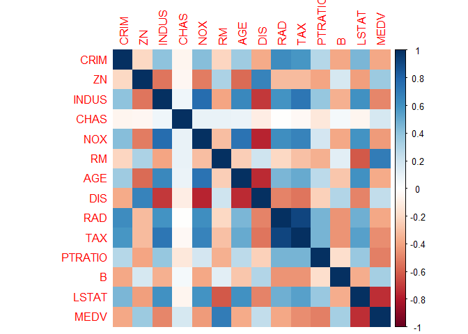

With the Boston housing data as our backdrop we observe the effect of different imputation methods ranging from single imputation via a global mean to multiple imputation methods. However this is dependent on missing data types, including missing completely at random, missing at random, and not missing at random. We assume the  data 'missing completely at random' is a result of the flooding in the basement where the housing records are stored. We also highlight the effect of listwise deletion on two extreme examples, data missing 1% and 50% for our feature PTRATIO. Data missing at random removes data for our columns CRIM and RAD that are dependent on Age. With intent we remove TAX data for our example of 'not missing at random' by removing data TAX data when it is equal to or less than 279. 

## Boston Data Set 

The Boston housing data set contains median housing prices collected bt the US Census Services and contains quantitative feature data such as the crime rate by town or the average number of rooms per dwelling.


## Initial Data Exploration

**Data Description**

The Boston data frame has 506 rows and 14 columns.

This data frame contains the following columns:
  
* CRIM - per capita crime rate by town
* ZN - proportion of residential land zoned for lots over 25,000 sq.ft.
* INDUS - proportion of non-retail business acres per town.
* CHAS - Charles River dummy variable (1 if tract bounds river; 0 otherwise)
* NOX - nitric oxides concentration (parts per 10 million)
* RM - average number of rooms per dwelling
* AGE - proportion of owner-occupied units built prior to 1940
* DIS - weighted distances to five Boston employment centres
* RAD - index of accessibility to radial highways
* TAX - full-value property-tax rate per $10,000
* PTRATIO - pupil-teacher ratio by town
* B - 1000(Bk - 0.63)^2 where Bk is the proportion of blacks by town
* LSTAT - % lower status of the population
* MEDV - Median value of owner-occupied homes in $1000's


**Data Exploration**

The dataset reflects numeric values both integer and float type data. 


```
## 'data.frame':	506 obs. of  14 variables:
##  $ CRIM   : num  0.00632 0.02731 0.02729 0.03237 0.06905 ...
##  $ ZN     : num  18 0 0 0 0 0 12.5 12.5 12.5 12.5 ...
##  $ INDUS  : num  2.31 7.07 7.07 2.18 2.18 2.18 7.87 7.87 7.87 7.87 ...
##  $ CHAS   : int  0 0 0 0 0 0 0 0 0 0 ...
##  $ NOX    : num  0.538 0.469 0.469 0.458 0.458 0.458 0.524 0.524 0.524 0.524 ...
##  $ RM     : num  6.58 6.42 7.18 7 7.15 ...
##  $ AGE    : num  65.2 78.9 61.1 45.8 54.2 58.7 66.6 96.1 100 85.9 ...
##  $ DIS    : num  4.09 4.97 4.97 6.06 6.06 ...
##  $ RAD    : int  1 2 2 3 3 3 5 5 5 5 ...
##  $ TAX    : int  296 242 242 222 222 222 311 311 311 311 ...
##  $ PTRATIO: num  15.3 17.8 17.8 18.7 18.7 18.7 15.2 15.2 15.2 15.2 ...
##  $ B      : num  397 397 393 395 397 ...
##  $ LSTAT  : num  4.98 9.14 4.03 2.94 5.33 ...
##  $ MEDV   : num  24 21.6 34.7 33.4 36.2 28.7 22.9 27.1 16.5 18.9 ...
```

```
##       CRIM                ZN             INDUS            CHAS        
##  Min.   : 0.00632   Min.   :  0.00   Min.   : 0.46   Min.   :0.00000  
##  1st Qu.: 0.08204   1st Qu.:  0.00   1st Qu.: 5.19   1st Qu.:0.00000  
##  Median : 0.25651   Median :  0.00   Median : 9.69   Median :0.00000  
##  Mean   : 3.61352   Mean   : 11.36   Mean   :11.14   Mean   :0.06917  
##  3rd Qu.: 3.67708   3rd Qu.: 12.50   3rd Qu.:18.10   3rd Qu.:0.00000  
##  Max.   :88.97620   Max.   :100.00   Max.   :27.74   Max.   :1.00000  
##       NOX               RM             AGE              DIS        
##  Min.   :0.3850   Min.   :3.561   Min.   :  2.90   Min.   : 1.130  
##  1st Qu.:0.4490   1st Qu.:5.886   1st Qu.: 45.02   1st Qu.: 2.100  
##  Median :0.5380   Median :6.208   Median : 77.50   Median : 3.207  
##  Mean   :0.5547   Mean   :6.285   Mean   : 68.57   Mean   : 3.795  
##  3rd Qu.:0.6240   3rd Qu.:6.623   3rd Qu.: 94.08   3rd Qu.: 5.188  
##  Max.   :0.8710   Max.   :8.780   Max.   :100.00   Max.   :12.127  
##       RAD              TAX           PTRATIO            B         
##  Min.   : 1.000   Min.   :187.0   Min.   :12.60   Min.   :  0.32  
##  1st Qu.: 4.000   1st Qu.:279.0   1st Qu.:17.40   1st Qu.:375.38  
##  Median : 5.000   Median :330.0   Median :19.05   Median :391.44  
##  Mean   : 9.549   Mean   :408.2   Mean   :18.46   Mean   :356.67  
##  3rd Qu.:24.000   3rd Qu.:666.0   3rd Qu.:20.20   3rd Qu.:396.23  
##  Max.   :24.000   Max.   :711.0   Max.   :22.00   Max.   :396.90  
##      LSTAT            MEDV      
##  Min.   : 1.73   Min.   : 5.00  
##  1st Qu.: 6.95   1st Qu.:17.02  
##  Median :11.36   Median :21.20  
##  Mean   :12.65   Mean   :22.53  
##  3rd Qu.:16.95   3rd Qu.:25.00  
##  Max.   :37.97   Max.   :50.00
```


Skim allows a quick visual examination of each variable's range


Table: Data summary

                                     
-------------------------  ----------
Name                       boston.df 
Number of rows             506       
Number of columns          14        
_______________________              
Column type frequency:               
numeric                    14        
________________________             
Group variables            None      
-------------------------  ----------


**Variable type: numeric**

skim_variable    n_missing   complete_rate     mean       sd       p0      p25      p50      p75     p100  hist  
--------------  ----------  --------------  -------  -------  -------  -------  -------  -------  -------  ------
CRIM                     0               1     3.61     8.60     0.01     0.08     0.26     3.68    88.98  ▇▁▁▁▁ 
ZN                       0               1    11.36    23.32     0.00     0.00     0.00    12.50   100.00  ▇▁▁▁▁ 
INDUS                    0               1    11.14     6.86     0.46     5.19     9.69    18.10    27.74  ▇▆▁▇▁ 
CHAS                     0               1     0.07     0.25     0.00     0.00     0.00     0.00     1.00  ▇▁▁▁▁ 
NOX                      0               1     0.55     0.12     0.38     0.45     0.54     0.62     0.87  ▇▇▆▅▁ 
RM                       0               1     6.28     0.70     3.56     5.89     6.21     6.62     8.78  ▁▂▇▂▁ 
AGE                      0               1    68.57    28.15     2.90    45.02    77.50    94.07   100.00  ▂▂▂▃▇ 
DIS                      0               1     3.80     2.11     1.13     2.10     3.21     5.19    12.13  ▇▅▂▁▁ 
RAD                      0               1     9.55     8.71     1.00     4.00     5.00    24.00    24.00  ▇▂▁▁▃ 
TAX                      0               1   408.24   168.54   187.00   279.00   330.00   666.00   711.00  ▇▇▃▁▇ 
PTRATIO                  0               1    18.46     2.16    12.60    17.40    19.05    20.20    22.00  ▁▃▅▅▇ 
B                        0               1   356.67    91.29     0.32   375.38   391.44   396.23   396.90  ▁▁▁▁▇ 
LSTAT                    0               1    12.65     7.14     1.73     6.95    11.36    16.96    37.97  ▇▇▅▂▁ 
MEDV                     0               1    22.53     9.20     5.00    17.02    21.20    25.00    50.00  ▂▇▅▁▁ 


**Data Visualization**


```
## No id variables; using all as measure variables
```

<!-- -->


Initially created a correlation matrix to view the impact of multicollinearity for predictor variables that show high correlation.


```r
boston_cor<-cor(boston.df)
corrplot(boston_cor, method="color")
```

<!-- -->

**Missing Data**

No missing values found in our initial Boston data set as validated below.

<!-- -->

```
## 
##  Variables sorted by number of missings: 
##  Variable Count
##      CRIM     0
##        ZN     0
##     INDUS     0
##      CHAS     0
##       NOX     0
##        RM     0
##       AGE     0
##       DIS     0
##       RAD     0
##       TAX     0
##   PTRATIO     0
##         B     0
##     LSTAT     0
##      MEDV     0
```


# Initial Regression Model

We are doing a regression on full data set, predicting MEDV, the median value of owner-occupied homes, using the other 13 parameters.


**Exclude vs Omit**

Using na.exclude pads the residuals and fitted values with NAs where there were missing values. Other functions do not use the na.action, but instead have a different argument (with some default) for how they will handle missing values. For example, the mean command will, by default, return NA if there are any NAs in the passed object. The example below creates a threshold to measure the effect of different imputations.


```
## 
## Call:
## lm(formula = MEDV ~ ., data = boston.df, na.action = na.omit)
## 
## Residuals:
##     Min      1Q  Median      3Q     Max 
## -15.595  -2.730  -0.518   1.777  26.199 
## 
## Coefficients:
##               Estimate Std. Error t value Pr(>|t|)    
## (Intercept)  3.646e+01  5.103e+00   7.144 3.28e-12 ***
## CRIM        -1.080e-01  3.286e-02  -3.287 0.001087 ** 
## ZN           4.642e-02  1.373e-02   3.382 0.000778 ***
## INDUS        2.056e-02  6.150e-02   0.334 0.738288    
## CHAS         2.687e+00  8.616e-01   3.118 0.001925 ** 
## NOX         -1.777e+01  3.820e+00  -4.651 4.25e-06 ***
## RM           3.810e+00  4.179e-01   9.116  < 2e-16 ***
## AGE          6.922e-04  1.321e-02   0.052 0.958229    
## DIS         -1.476e+00  1.995e-01  -7.398 6.01e-13 ***
## RAD          3.060e-01  6.635e-02   4.613 5.07e-06 ***
## TAX         -1.233e-02  3.760e-03  -3.280 0.001112 ** 
## PTRATIO     -9.527e-01  1.308e-01  -7.283 1.31e-12 ***
## B            9.312e-03  2.686e-03   3.467 0.000573 ***
## LSTAT       -5.248e-01  5.072e-02 -10.347  < 2e-16 ***
## ---
## Signif. codes:  0 '***' 0.001 '**' 0.01 '*' 0.05 '.' 0.1 ' ' 1
## 
## Residual standard error: 4.745 on 492 degrees of freedom
## Multiple R-squared:  0.7406,	Adjusted R-squared:  0.7338 
## F-statistic: 108.1 on 13 and 492 DF,  p-value: < 2.2e-16
```

```
## [1] "SSE for model is: "
```

```
## [1] 11078.78
```

```
## [1] "MSE for model is: "
```

```
## [1] 21.89483
```


**RESULTS**

Improvements for different imputation methods can be measured with various statistics. Adjusted R-square or coefficient of determination can help us assess the models overall quality. Adjusted R-squared value would help us explain the proportion of variance of median house prices with the given predictor variables while also penalizing for large number of predictors. Fitting a linear regression model without imputation results in a R-square of .7338, which means roughly 73.4% of the MEDV response variable is accounted for by the other 13 predictors. The accuracy of the model can be captured by looking at our residuals or actual median house prices minus predicted house prices. The baseline model results in a total sum of square errors of 11078. The goal will be to have a large R-square and small sum of squares error value. These results reflect the effect of listwise deletion on data missing completely at random (MCAR).

<center>
The Sum of Squares Error [SSE] for model is: <b>11078.78</b>

The Mean Square Error [MSE] for model is: <b>21.89483</b>

Adjusted R-squared: <b>.7338</b>
</center>

NOTE: Because AGE and INDUS were found to not be statistically significant we will *not* use those for the missing data exercises


# Missing Completely at Random with Regression: Single Imputation & Multiple Imputation
<br>

We will measure the effect of single imputation and multiple imputation using the PTRATIO, or pupil to teacher ratio. For our single imputation method we will use a global mean to replace our missing values for PTRATIO. This is under the backdrop of observations that are missing completely at random, or MCAR. We assume the housing records were flooded and we lost a random number of data sets at different rates. We will also use listwise deletion for our data sets missing 1% and 50% to measure the magnified effect to our mean square error and adjusted R-square.

First generate vector of *unique* random numbers to correspond to each percentage

* 1% - 5 entries
* 5% - 25 entries
* 10% - 51 entries
* 20% - 102 entries
* 33% - 168 entries
* 50% - 253 entries 


**Value to be Deleted**
<br>
PTRATIO - pupil-teacher ratio by town

Create vector to serve as sample index for creating NA values


**Create different boston samples with NA for PTRATIO**

We visualize the prorportion of missing value sets ranging from 1% to 50%, with their corresponding volume.

1% - 5 entries 


```
## [1] NA NA NA NA NA
```

<!-- -->

```
## 
##  Variables sorted by number of missings: 
##  Variable Count
##   PTRATIO     5
##      CRIM     0
##        ZN     0
##     INDUS     0
##      CHAS     0
##       NOX     0
##        RM     0
##       AGE     0
##       DIS     0
##       RAD     0
##       TAX     0
##         B     0
##     LSTAT     0
##      MEDV     0
```


5% - 25 entries


```
## [1] NA NA NA NA NA NA
```

<!-- -->

```
## 
##  Variables sorted by number of missings: 
##  Variable Count
##   PTRATIO    25
##      CRIM     0
##        ZN     0
##     INDUS     0
##      CHAS     0
##       NOX     0
##        RM     0
##       AGE     0
##       DIS     0
##       RAD     0
##       TAX     0
##         B     0
##     LSTAT     0
##      MEDV     0
```


10% - 51 entries


```
## [1] NA NA NA NA NA NA
```

<!-- -->

```
## 
##  Variables sorted by number of missings: 
##  Variable Count
##   PTRATIO    51
##      CRIM     0
##        ZN     0
##     INDUS     0
##      CHAS     0
##       NOX     0
##        RM     0
##       AGE     0
##       DIS     0
##       RAD     0
##       TAX     0
##         B     0
##     LSTAT     0
##      MEDV     0
```


20% - 102 entries


```
## [1] NA NA NA NA NA NA
```

<!-- -->

```
## 
##  Variables sorted by number of missings: 
##  Variable Count
##   PTRATIO   102
##      CRIM     0
##        ZN     0
##     INDUS     0
##      CHAS     0
##       NOX     0
##        RM     0
##       AGE     0
##       DIS     0
##       RAD     0
##       TAX     0
##         B     0
##     LSTAT     0
##      MEDV     0
```


33% - 168 entries


```
## [1] NA NA NA NA NA NA
```

<!-- -->

```
## 
##  Variables sorted by number of missings: 
##  Variable Count
##   PTRATIO   168
##      CRIM     0
##        ZN     0
##     INDUS     0
##      CHAS     0
##       NOX     0
##        RM     0
##       AGE     0
##       DIS     0
##       RAD     0
##       TAX     0
##         B     0
##     LSTAT     0
##      MEDV     0
```


50% - 253 entries


```
## [1] NA NA NA NA NA NA
```

<!-- -->

```
## 
##  Variables sorted by number of missings: 
##  Variable Count
##   PTRATIO   253
##      CRIM     0
##        ZN     0
##     INDUS     0
##      CHAS     0
##       NOX     0
##        RM     0
##       AGE     0
##       DIS     0
##       RAD     0
##       TAX     0
##         B     0
##     LSTAT     0
##      MEDV     0
```


## Single Imputation with Mean


**1% - 5 entries**

Adjusted R-squared:  0.7344
[1] "SSE for model is: "
[1] 11052.98
[1] "MSE for model is: "
[1] 21.84383


```
## 
## Call:
## lm(formula = MEDV ~ ., data = boston_mcar_01.df)
## 
## Residuals:
##      Min       1Q   Median       3Q      Max 
## -15.8057  -2.7430  -0.5208   1.8096  26.3074 
## 
## Coefficients:
##               Estimate Std. Error t value Pr(>|t|)    
## (Intercept)  3.509e+01  5.067e+00   6.925 1.37e-11 ***
## CRIM        -1.072e-01  3.298e-02  -3.252 0.001224 ** 
## ZN           4.779e-02  1.376e-02   3.473 0.000560 ***
## INDUS        1.677e-02  6.167e-02   0.272 0.785793    
## CHAS         2.668e+00  8.651e-01   3.084 0.002159 ** 
## NOX         -1.709e+01  3.816e+00  -4.478 9.37e-06 ***
## RM           3.886e+00  4.181e-01   9.295  < 2e-16 ***
## AGE          8.995e-04  1.326e-02   0.068 0.945944    
## DIS         -1.481e+00  2.001e-01  -7.402 5.87e-13 ***
## RAD          3.018e-01  6.654e-02   4.535 7.25e-06 ***
## TAX         -1.255e-02  3.772e-03  -3.326 0.000947 ***
## PTRATIO     -9.173e-01  1.307e-01  -7.019 7.43e-12 ***
## B            9.415e-03  2.696e-03   3.492 0.000522 ***
## LSTAT       -5.255e-01  5.089e-02 -10.326  < 2e-16 ***
## ---
## Signif. codes:  0 '***' 0.001 '**' 0.01 '*' 0.05 '.' 0.1 ' ' 1
## 
## Residual standard error: 4.762 on 492 degrees of freedom
## Multiple R-squared:  0.7388,	Adjusted R-squared:  0.7319 
## F-statistic: 107.1 on 13 and 492 DF,  p-value: < 2.2e-16
```

```
## [1] "SSE for model is: "
```

```
## [1] 11155.78
```

```
## [1] "MSE for model is: "
```

```
## [1] 22.047
```


**5% - 25 entries**

Adjusted R-squared:  0.7313

[1] "SSE for model is: "
[1] 11182.17
[1] "MSE for model is: "
[1] 22.09915


```
## 
## Call:
## lm(formula = MEDV ~ ., data = boston_mcar_05.df)
## 
## Residuals:
##      Min       1Q   Median       3Q      Max 
## -15.8762  -2.6750  -0.6538   1.7534  26.4546 
## 
## Coefficients:
##               Estimate Std. Error t value Pr(>|t|)    
## (Intercept)  3.384e+01  5.130e+00   6.596 1.09e-10 ***
## CRIM        -1.079e-01  3.321e-02  -3.248 0.001243 ** 
## ZN           5.026e-02  1.384e-02   3.630 0.000313 ***
## INDUS       -9.871e-04  6.188e-02  -0.016 0.987280    
## CHAS         2.745e+00  8.708e-01   3.152 0.001719 ** 
## NOX         -1.633e+01  3.836e+00  -4.256 2.49e-05 ***
## RM           3.905e+00  4.213e-01   9.268  < 2e-16 ***
## AGE          1.887e-04  1.335e-02   0.014 0.988731    
## DIS         -1.507e+00  2.013e-01  -7.485 3.32e-13 ***
## RAD          2.882e-01  6.682e-02   4.313 1.94e-05 ***
## TAX         -1.238e-02  3.802e-03  -3.255 0.001212 ** 
## PTRATIO     -8.556e-01  1.326e-01  -6.454 2.61e-10 ***
## B            9.215e-03  2.714e-03   3.395 0.000742 ***
## LSTAT       -5.251e-01  5.126e-02 -10.244  < 2e-16 ***
## ---
## Signif. codes:  0 '***' 0.001 '**' 0.01 '*' 0.05 '.' 0.1 ' ' 1
## 
## Residual standard error: 4.796 on 492 degrees of freedom
## Multiple R-squared:  0.7351,	Adjusted R-squared:  0.7281 
## F-statistic:   105 on 13 and 492 DF,  p-value: < 2.2e-16
```

```
## [1] "SSE for model is: "
```

```
## [1] 11315.06
```

```
## [1] "MSE for model is: "
```

```
## [1] 22.36178
```


**10% - 51 entries**

Adjusted R-squared:  0.7345 
[1] "SSE for model is: "
[1] 11049.58
[1] "MSE for model is: "
[1] 21.83712


```
## 
## Call:
## lm(formula = MEDV ~ ., data = boston_mcar_10.df)
## 
## Residuals:
##      Min       1Q   Median       3Q      Max 
## -15.3288  -2.7283  -0.5455   1.9613  25.1597 
## 
## Coefficients:
##               Estimate Std. Error t value Pr(>|t|)    
## (Intercept)  38.482790   5.219666   7.373 7.14e-13 ***
## CRIM         -0.106873   0.032787  -3.260 0.001193 ** 
## ZN            0.045654   0.013701   3.332 0.000927 ***
## INDUS         0.026066   0.061432   0.424 0.671536    
## CHAS          2.719286   0.859066   3.165 0.001645 ** 
## NOX         -17.850848   3.806251  -4.690 3.55e-06 ***
## RM            3.734333   0.418457   8.924  < 2e-16 ***
## AGE           0.001127   0.013183   0.086 0.931888    
## DIS          -1.498876   0.198701  -7.543 2.23e-13 ***
## RAD           0.304931   0.066119   4.612 5.10e-06 ***
## TAX          -0.012890   0.003747  -3.440 0.000630 ***
## PTRATIO      -1.006280   0.135029  -7.452 4.16e-13 ***
## B             0.008814   0.002678   3.291 0.001070 ** 
## LSTAT        -0.532088   0.050563 -10.523  < 2e-16 ***
## ---
## Signif. codes:  0 '***' 0.001 '**' 0.01 '*' 0.05 '.' 0.1 ' ' 1
## 
## Residual standard error: 4.734 on 492 degrees of freedom
## Multiple R-squared:  0.7418,	Adjusted R-squared:  0.735 
## F-statistic: 108.7 on 13 and 492 DF,  p-value: < 2.2e-16
```

```
## [1] "SSE for model is: "
```

```
## [1] 11028.16
```

```
## [1] "MSE for model is: "
```

```
## [1] 21.79478
```


**20% - 102 entries**

Adjusted R-squared:  0.7231 
[1] "SSE for model is: "
[1] 11523.58
[1] "MSE for model is: "
[1] 22.77388


```
## 
## Call:
## lm(formula = MEDV ~ ., data = boston_mcar_20.df)
## 
## Residuals:
##     Min      1Q  Median      3Q     Max 
## -16.192  -2.710  -0.583   1.783  26.656 
## 
## Coefficients:
##               Estimate Std. Error t value Pr(>|t|)    
## (Intercept)  31.740495   5.199534   6.104 2.09e-09 ***
## CRIM         -0.103895   0.033515  -3.100 0.002046 ** 
## ZN            0.056591   0.013814   4.097 4.90e-05 ***
## INDUS         0.001151   0.062571   0.018 0.985328    
## CHAS          2.790031   0.879136   3.174 0.001600 ** 
## NOX         -14.895896   3.843791  -3.875 0.000121 ***
## RM            3.987276   0.424344   9.396  < 2e-16 ***
## AGE          -0.003230   0.013448  -0.240 0.810304    
## DIS          -1.513634   0.203290  -7.446 4.35e-13 ***
## RAD           0.271574   0.067211   4.041 6.19e-05 ***
## TAX          -0.012507   0.003839  -3.258 0.001201 ** 
## PTRATIO      -0.791877   0.140249  -5.646 2.78e-08 ***
## B             0.009452   0.002742   3.447 0.000615 ***
## LSTAT        -0.529920   0.051717 -10.247  < 2e-16 ***
## ---
## Signif. codes:  0 '***' 0.001 '**' 0.01 '*' 0.05 '.' 0.1 ' ' 1
## 
## Residual standard error: 4.84 on 492 degrees of freedom
## Multiple R-squared:  0.7302,	Adjusted R-squared:  0.723 
## F-statistic: 102.4 on 13 and 492 DF,  p-value: < 2.2e-16
```

```
## [1] "SSE for model is: "
```

```
## [1] 11526.16
```

```
## [1] "MSE for model is: "
```

```
## [1] 22.77898
```


**33% - 168 entries**

Adjusted R-squared:  0.7205 
[1] "SSE for model is: "
[1] 11632.02
[1] "MSE for model is: "
[1] 22.98819


```
## 
## Call:
## lm(formula = MEDV ~ ., data = boston_mcar_33.df)
## 
## Residuals:
##      Min       1Q   Median       3Q      Max 
## -17.3358  -2.9253  -0.8136   1.8613  26.9448 
## 
## Coefficients:
##               Estimate Std. Error t value Pr(>|t|)    
## (Intercept)  30.156380   5.290798   5.700 2.07e-08 ***
## CRIM         -0.107457   0.033762  -3.183 0.001551 ** 
## ZN            0.064993   0.013637   4.766 2.48e-06 ***
## INDUS        -0.025765   0.062677  -0.411 0.681193    
## CHAS          2.807614   0.886114   3.168 0.001628 ** 
## NOX         -13.311603   3.824329  -3.481 0.000544 ***
## RM            4.024110   0.427300   9.418  < 2e-16 ***
## AGE          -0.002230   0.013559  -0.164 0.869457    
## DIS          -1.578567   0.204083  -7.735 5.90e-14 ***
## RAD           0.253134   0.067368   3.757 0.000192 ***
## TAX          -0.012892   0.003864  -3.337 0.000912 ***
## PTRATIO      -0.722742   0.145770  -4.958 9.81e-07 ***
## B             0.009149   0.002759   3.316 0.000982 ***
## LSTAT        -0.523862   0.052161 -10.043  < 2e-16 ***
## ---
## Signif. codes:  0 '***' 0.001 '**' 0.01 '*' 0.05 '.' 0.1 ' ' 1
## 
## Residual standard error: 4.874 on 492 degrees of freedom
## Multiple R-squared:  0.7264,	Adjusted R-squared:  0.7191 
## F-statistic: 100.5 on 13 and 492 DF,  p-value: < 2.2e-16
```

```
## [1] "SSE for model is: "
```

```
## [1] 11688.98
```

```
## [1] "MSE for model is: "
```

```
## [1] 23.10074
```


**50% - 253 entries** 

Adjusted R-squared:  0.7142 
[1] "SSE for model is: "
[1] 11894.22
[1] "MSE for model is: "
[1] 23.50637


```
## 
## Call:
## lm(formula = MEDV ~ ., data = boston_mcar_50.df)
## 
## Residuals:
##      Min       1Q   Median       3Q      Max 
## -17.3968  -2.9371  -0.7763   1.8929  26.1041 
## 
## Coefficients:
##               Estimate Std. Error t value Pr(>|t|)    
## (Intercept)  29.398190   5.476171   5.368 1.23e-07 ***
## CRIM         -0.110825   0.033982  -3.261 0.001186 ** 
## ZN            0.063456   0.013855   4.580 5.89e-06 ***
## INDUS        -0.010540   0.063277  -0.167 0.867778    
## CHAS          3.118433   0.886613   3.517 0.000476 ***
## NOX         -12.574319   3.834472  -3.279 0.001114 ** 
## RM            4.007840   0.431160   9.295  < 2e-16 ***
## AGE          -0.004325   0.013613  -0.318 0.750850    
## DIS          -1.526997   0.205998  -7.413 5.44e-13 ***
## RAD           0.234032   0.067431   3.471 0.000565 ***
## TAX          -0.013060   0.003885  -3.362 0.000835 ***
## PTRATIO      -0.693944   0.159166  -4.360 1.59e-05 ***
## B             0.008782   0.002773   3.167 0.001634 ** 
## LSTAT        -0.525764   0.052447 -10.025  < 2e-16 ***
## ---
## Signif. codes:  0 '***' 0.001 '**' 0.01 '*' 0.05 '.' 0.1 ' ' 1
## 
## Residual standard error: 4.901 on 492 degrees of freedom
## Multiple R-squared:  0.7234,	Adjusted R-squared:  0.7161 
## F-statistic: 98.97 on 13 and 492 DF,  p-value: < 2.2e-16
```

```
## [1] "SSE for model is: "
```

```
## [1] 11816.48
```

```
## [1] "MSE for model is: "
```

```
## [1] 23.35274
```

Overall our adjusted R-square value fell as we increased the amount of missing data and filled with a global mean. In contrast our sum of square increased as we filled more missing data with a global mean. 

## Listwise Deletion at 1% MCAR and 50% MCAR

The listewise approach will remove the 1% and 50% missing data and model thereafter using our lm function.


```r
lwd1 <- lm( MEDV ~ . , data = boston_mcar_01.df, na.action = na.omit  )

# model results for goodness of fit using adj r-sqr
summary(lwd1)
```

```
## 
## Call:
## lm(formula = MEDV ~ ., data = boston_mcar_01.df, na.action = na.omit)
## 
## Residuals:
##      Min       1Q   Median       3Q      Max 
## -15.8057  -2.7430  -0.5208   1.8096  26.3074 
## 
## Coefficients:
##               Estimate Std. Error t value Pr(>|t|)    
## (Intercept)  3.509e+01  5.067e+00   6.925 1.37e-11 ***
## CRIM        -1.072e-01  3.298e-02  -3.252 0.001224 ** 
## ZN           4.779e-02  1.376e-02   3.473 0.000560 ***
## INDUS        1.677e-02  6.167e-02   0.272 0.785793    
## CHAS         2.668e+00  8.651e-01   3.084 0.002159 ** 
## NOX         -1.709e+01  3.816e+00  -4.478 9.37e-06 ***
## RM           3.886e+00  4.181e-01   9.295  < 2e-16 ***
## AGE          8.995e-04  1.326e-02   0.068 0.945944    
## DIS         -1.481e+00  2.001e-01  -7.402 5.87e-13 ***
## RAD          3.018e-01  6.654e-02   4.535 7.25e-06 ***
## TAX         -1.255e-02  3.772e-03  -3.326 0.000947 ***
## PTRATIO     -9.173e-01  1.307e-01  -7.019 7.43e-12 ***
## B            9.415e-03  2.696e-03   3.492 0.000522 ***
## LSTAT       -5.255e-01  5.089e-02 -10.326  < 2e-16 ***
## ---
## Signif. codes:  0 '***' 0.001 '**' 0.01 '*' 0.05 '.' 0.1 ' ' 1
## 
## Residual standard error: 4.762 on 492 degrees of freedom
## Multiple R-squared:  0.7388,	Adjusted R-squared:  0.7319 
## F-statistic: 107.1 on 13 and 492 DF,  p-value: < 2.2e-16
```


```
## [1] "SSE for model is:  11155.7833306094"
```

```
## [1] "MSE for model is: 22.0470026296628"
```


```r
lwd50 <- lm( MEDV ~ . , data = boston_mcar_50.df, na.action = na.omit  )

# model results for goodness of fit using adj r-sqr
summary(lwd50)
```

```
## 
## Call:
## lm(formula = MEDV ~ ., data = boston_mcar_50.df, na.action = na.omit)
## 
## Residuals:
##      Min       1Q   Median       3Q      Max 
## -17.3968  -2.9371  -0.7763   1.8929  26.1041 
## 
## Coefficients:
##               Estimate Std. Error t value Pr(>|t|)    
## (Intercept)  29.398190   5.476171   5.368 1.23e-07 ***
## CRIM         -0.110825   0.033982  -3.261 0.001186 ** 
## ZN            0.063456   0.013855   4.580 5.89e-06 ***
## INDUS        -0.010540   0.063277  -0.167 0.867778    
## CHAS          3.118433   0.886613   3.517 0.000476 ***
## NOX         -12.574319   3.834472  -3.279 0.001114 ** 
## RM            4.007840   0.431160   9.295  < 2e-16 ***
## AGE          -0.004325   0.013613  -0.318 0.750850    
## DIS          -1.526997   0.205998  -7.413 5.44e-13 ***
## RAD           0.234032   0.067431   3.471 0.000565 ***
## TAX          -0.013060   0.003885  -3.362 0.000835 ***
## PTRATIO      -0.693944   0.159166  -4.360 1.59e-05 ***
## B             0.008782   0.002773   3.167 0.001634 ** 
## LSTAT        -0.525764   0.052447 -10.025  < 2e-16 ***
## ---
## Signif. codes:  0 '***' 0.001 '**' 0.01 '*' 0.05 '.' 0.1 ' ' 1
## 
## Residual standard error: 4.901 on 492 degrees of freedom
## Multiple R-squared:  0.7234,	Adjusted R-squared:  0.7161 
## F-statistic: 98.97 on 13 and 492 DF,  p-value: < 2.2e-16
```


```
## [1] "SSE for model is: 11816.4849845115"
```

```
## [1] "MSE for model is: 23.3527371235405"
```


## Multiple Imputation with Mice

We impute the data with Mice with default parameters and return 5 different imputations that are then pooled together. The default imputation method is applied or predictive mean matching. This method pools samples of complete data set, or uses actual values for those with complete data for our student to teacher ratio.


```r
imp_01 <- mice(boston_mcar_01.df,  m = 5)
imp_05 <- mice(boston_mcar_05.df,  m = 5)
imp_10 <- mice(boston_mcar_10.df,  m = 5)
imp_20 <- mice(boston_mcar_20.df,  m = 5)
imp_33 <- mice(boston_mcar_33.df,  m = 5)
```

The function mice below will create 5 different imputation sets. The imputation sets are identified via the iter column.


```r
imp_50 <- mice(boston_mcar_50.df,  m = 5)
```

```
## 
##  iter imp variable
##   1   1
##   1   2
##   1   3
##   1   4
##   1   5
##   2   1
##   2   2
##   2   3
##   2   4
##   2   5
##   3   1
##   3   2
##   3   3
##   3   4
##   3   5
##   4   1
##   4   2
##   4   3
##   4   4
##   4   5
##   5   1
##   5   2
##   5   3
##   5   4
##   5   5
```


```r
head(imp_50$imp$PTRATIO)
```

```
## [1] 1 2 3 4 5
## <0 rows> (or 0-length row.names)
```

We incorporate all 5 imputation possibilities back into our data and transform it into a long dataframe. Each of these imputed values represent a sample from a distribution. 


```r
boston.lm50_long <- complete(imp_50, action="long", include = TRUE)
```

We can see there are 5 new datasets with their respective imputed data sets, 0 acting as our original data set.


```r
table(boston.lm50_long$.imp)
```

```
## 
##   0   1   2   3   4   5 
## 506 506 506 506 506 506
```

We change our dataframe to type a mids or multiply imputed object.


```r
imp_long_mids50 <- as.mids(boston.lm50_long)
```

We run our linear model using this object which runs all 5 different iterations of our data set. Using the pool function from Mice we take the average of every model. 


```r
fitimp50 <- with(imp_long_mids50,
               lm(MEDV ~   CRIM + ZN + INDUS + CHAS + NOX + RM + AGE + DIS + RAD + TAX + PTRATIO + B + LSTAT))
```

Multiple imputation results with 50% missing data.


```r
summary(pool(fitimp50))
```

```
##           term      estimate   std.error   statistic       df      p.value
## 1  (Intercept)  29.398190371 5.476170875   5.3683844 489.9625 1.228689e-07
## 2         CRIM  -0.110825273 0.033981559  -3.2613358 489.9625 1.186151e-03
## 3           ZN   0.063455712 0.013854531   4.5801413 489.9625 5.900656e-06
## 4        INDUS  -0.010540062 0.063277487  -0.1665689 489.9625 8.677780e-01
## 5         CHAS   3.118433443 0.886613008   3.5172431 489.9625 4.766246e-04
## 6          NOX -12.574319325 3.834471830  -3.2792833 489.9625 1.114751e-03
## 7           RM   4.007840322 0.431160089   9.2954808 489.9625 0.000000e+00
## 8          AGE  -0.004324760 0.013612856  -0.3176967 489.9625 7.508503e-01
## 9          DIS  -1.526996664 0.205998457  -7.4126607 489.9625 5.475620e-13
## 10         RAD   0.234032059 0.067430770   3.4707013 489.9625 5.649784e-04
## 11         TAX  -0.013059880 0.003884847  -3.3617489 489.9625 8.350724e-04
## 12     PTRATIO  -0.693944346 0.159165925  -4.3598801 489.9625 1.586923e-05
## 13           B   0.008781542 0.002772538   3.1673293 489.9625 1.634443e-03
## 14       LSTAT  -0.525763627 0.052447351 -10.0245984 489.9625 0.000000e+00
```

```r
pool.r.squared(fitimp50, adjusted=TRUE)
```

```
##               est     lo 95     hi 95 fmi
## adj R^2 0.7160636 0.6715532 0.7556059 NaN
```

Results for other missing data sets.


```r
pool.r.squared(fitimp01, adjusted=TRUE)
```

```
##               est     lo 95     hi 95 fmi
## adj R^2 0.7319395 0.6893726 0.7696199 NaN
```

```r
pool.r.squared(fitimp05, adjusted=TRUE)
```

```
##               est     lo 95     hi 95 fmi
## adj R^2 0.7281123 0.6850705 0.7662458 NaN
```

```r
pool.r.squared(fitimp10, adjusted=TRUE)
```

```
##               est     lo 95     hi 95 fmi
## adj R^2 0.7350062 0.6928226 0.7723216 NaN
```

```r
pool.r.squared(fitimp20, adjusted=TRUE)
```

```
##               est     lo 95     hi 95 fmi
## adj R^2 0.7230397 0.6793748 0.7617695 NaN
```

```r
pool.r.squared(fitimp33, adjusted=TRUE)
```

```
##               est     lo 95     hi 95 fmi
## adj R^2 0.7191275 0.6749868 0.7583141 NaN
```

Interestingly our adjusted r-squared value remain pretty constant when filling out missing data from a distribution pool from our multiple imputation method. 

## Results

Notable was imputation using single imputation and listwise deletion when the amount of missing data was small. The effect of removing those observations resulted in a no differences to our adjusted R-square value when compared against a single imputation approach at an adjusted R-square of 73.11. This is close to as high as we can go with this linear model as the adjusted R-square for our original model with all the data is at 73.38. If we are ok with these results all approaches above work well, however if we want to optimize our model we might want to change to something completely different as the linear model creates a ceiling we can't exceed with imputation alone. We can however improve the model optimizing the model itself as imputation does little.

# Missing at Random with Regression: Single Imputation & Multiple Imputation

**Determining Parameter for Deletion**
<br>
AGE < 80 = 266 entries 

**Values to be Deleted**
<br>
CRIM - per capita crime rate by town
<br>
RAD - index of accessibility to radial highways


```r
# list rows with AGE < 80 
boston.df[boston.df$AGE < 80,c("CRIM","RAD")]


# create initial MAR index
rownames( boston.df[boston.df$AGE < 80,c("CRIM","RAD")] ) %>% as.numeric() -> index_mar

#create 10% MAR index
sample(index_mar, 50 ) -> index_mar_10

#create 20% MAR index
sample(index_mar, 100) -> index_mar_20

#create 30% MAR index
sample(index_mar, 150) -> index_mar_30
```


**Replacement**


```r
# create 10% MAR dataframe
boston.df -> boston_mar_10.df

# create 20% MAR dataframe
boston.df -> boston_mar_20.df

# create 30% MAR dataframe
boston.df -> boston_mar_30.df


#assign NA to CRIM & RAD for 10% MAR
boston_mar_10.df[index_mar_10, c("CRIM","RAD")] <- NA

#assign NA to CRIM & RAD for 20% MAR
boston_mar_20.df[index_mar_20, c("CRIM","RAD")] <- NA

#assign NA to CRIM & RAD for 30% MAR
boston_mar_30.df[index_mar_30, c("CRIM","RAD")] <- NA
```

**Validation **

We validate that 10, 20, and 30 percent of our data is missing with a quick glance at the graphs below.


```r
gg_miss_var(boston_mar_10.df, show_pct = TRUE)
```

<!-- -->

```r
gg_miss_var(boston_mar_20.df, show_pct = TRUE)
```

<!-- -->

```r
gg_miss_var(boston_mar_30.df, show_pct = TRUE)
```

<!-- -->


### MAR 10%

When AGE < 80, 10% of the entries for CRIM and RAD will be replaced with the NA value


**Validation**


## Single Imputation with Mean

**Regression Using Mean Substitution**

Adjusted R-squared:  0.7312 
[1] "SSE for model is: "
[1] 11188.48
[1] "MSE for model is: "
[1] 22.11163


```
## 
## Call:
## lm(formula = MEDV ~ ., data = boston_mar_10.df)
## 
## Residuals:
##      Min       1Q   Median       3Q      Max 
## -15.8052  -2.7753  -0.5228   1.9017  26.0403 
## 
## Coefficients:
##               Estimate Std. Error t value Pr(>|t|)    
## (Intercept)  3.642e+01  5.075e+00   7.176 2.66e-12 ***
## CRIM        -1.099e-01  3.280e-02  -3.351 0.000867 ***
## ZN           4.521e-02  1.368e-02   3.305 0.001019 ** 
## INDUS        2.619e-02  6.152e-02   0.426 0.670447    
## CHAS         2.693e+00  8.598e-01   3.132 0.001840 ** 
## NOX         -1.840e+01  3.833e+00  -4.802 2.09e-06 ***
## RM           3.843e+00  4.158e-01   9.244  < 2e-16 ***
## AGE          9.154e-04  1.319e-02   0.069 0.944716    
## DIS         -1.509e+00  1.988e-01  -7.592 1.59e-13 ***
## RAD          2.968e-01  6.104e-02   4.862 1.57e-06 ***
## TAX         -1.129e-02  3.436e-03  -3.286 0.001087 ** 
## PTRATIO     -9.559e-01  1.305e-01  -7.323 9.96e-13 ***
## B            9.236e-03  2.675e-03   3.452 0.000603 ***
## LSTAT       -5.282e-01  5.067e-02 -10.423  < 2e-16 ***
## ---
## Signif. codes:  0 '***' 0.001 '**' 0.01 '*' 0.05 '.' 0.1 ' ' 1
## 
## Residual standard error: 4.738 on 492 degrees of freedom
## Multiple R-squared:  0.7414,	Adjusted R-squared:  0.7346 
## F-statistic: 108.5 on 13 and 492 DF,  p-value: < 2.2e-16
```

```
## [1] "SSE for model is: "
```

```
## [1] 11046.88
```

```
## [1] "MSE for model is: "
```

```
## [1] 21.83179
```


### MAR 20%

When AGE < 80, 20% of the entries for CRIM and RAD will be replaced with the NA value


**Validation**


**Regression Using Mean Substitution**

Adjusted R-squared:  0.7292 
[1] "SSE for model is: "
[1] 11267.98
[1] "MSE for model is: "
[1] 22.26873


```
## 
## Call:
## lm(formula = MEDV ~ ., data = boston_mar_20.df)
## 
## Residuals:
##      Min       1Q   Median       3Q      Max 
## -16.0630  -2.8439  -0.6075   1.8619  26.6834 
## 
## Coefficients:
##               Estimate Std. Error t value Pr(>|t|)    
## (Intercept)  3.322e+01  5.035e+00   6.598 1.08e-10 ***
## CRIM        -1.085e-01  3.388e-02  -3.203 0.001449 ** 
## ZN           4.366e-02  1.383e-02   3.156 0.001700 ** 
## INDUS       -8.658e-03  6.154e-02  -0.141 0.888175    
## CHAS         2.855e+00  8.684e-01   3.287 0.001084 ** 
## NOX         -1.702e+01  3.852e+00  -4.418 1.23e-05 ***
## RM           3.988e+00  4.181e-01   9.539  < 2e-16 ***
## AGE         -7.737e-04  1.337e-02  -0.058 0.953890    
## DIS         -1.495e+00  2.014e-01  -7.424 5.04e-13 ***
## RAD          1.886e-01  5.588e-02   3.375 0.000797 ***
## TAX         -5.864e-03  3.116e-03  -1.882 0.060478 .  
## PTRATIO     -9.174e-01  1.319e-01  -6.957 1.11e-11 ***
## B            8.952e-03  2.695e-03   3.321 0.000963 ***
## LSTAT       -5.158e-01  5.118e-02 -10.077  < 2e-16 ***
## ---
## Signif. codes:  0 '***' 0.001 '**' 0.01 '*' 0.05 '.' 0.1 ' ' 1
## 
## Residual standard error: 4.792 on 492 degrees of freedom
## Multiple R-squared:  0.7355,	Adjusted R-squared:  0.7286 
## F-statistic: 105.3 on 13 and 492 DF,  p-value: < 2.2e-16
```

```
## [1] "SSE for model is: "
```

```
## [1] 11296.73
```

```
## [1] "MSE for model is: "
```

```
## [1] 22.32555
```


### MAR 30%

When AGE < 80, 30% of the entries for CRIM and RAD will be replaced with the NA value


**Validation**


**Regression Using Mean Substitution**

Adjusted R-squared:  0.7325 
[1] "SSE for model is: "
[1] 11133.25
[1] "MSE for model is: "
[1] 22.00247


```
## 
## Call:
## lm(formula = MEDV ~ ., data = boston_mar_30.df)
## 
## Residuals:
##      Min       1Q   Median       3Q      Max 
## -16.0988  -2.8693  -0.5657   2.0093  26.4732 
## 
## Coefficients:
##               Estimate Std. Error t value Pr(>|t|)    
## (Intercept)  3.335e+01  5.013e+00   6.654 7.62e-11 ***
## CRIM        -1.065e-01  3.337e-02  -3.190 0.001511 ** 
## ZN           4.091e-02  1.376e-02   2.973 0.003097 ** 
## INDUS        6.896e-03  6.222e-02   0.111 0.911789    
## CHAS         2.754e+00  8.691e-01   3.169 0.001624 ** 
## NOX         -1.761e+01  3.866e+00  -4.555 6.62e-06 ***
## RM           3.987e+00  4.172e-01   9.558  < 2e-16 ***
## AGE          3.991e-04  1.340e-02   0.030 0.976263    
## DIS         -1.465e+00  2.011e-01  -7.287 1.27e-12 ***
## RAD          2.044e-01  5.457e-02   3.746 0.000201 ***
## TAX         -6.104e-03  2.969e-03  -2.056 0.040325 *  
## PTRATIO     -9.324e-01  1.320e-01  -7.062 5.62e-12 ***
## B            9.229e-03  2.702e-03   3.415 0.000690 ***
## LSTAT       -5.196e-01  5.095e-02 -10.198  < 2e-16 ***
## ---
## Signif. codes:  0 '***' 0.001 '**' 0.01 '*' 0.05 '.' 0.1 ' ' 1
## 
## Residual standard error: 4.784 on 492 degrees of freedom
## Multiple R-squared:  0.7364,	Adjusted R-squared:  0.7294 
## F-statistic: 105.7 on 13 and 492 DF,  p-value: < 2.2e-16
```

```
## [1] "SSE for model is: "
```

```
## [1] 11260.35
```

```
## [1] "MSE for model is: "
```

```
## [1] 22.25367
```

## Multiple Imputation with Mice


```r
imp_10 <- mice(boston_mar_10.df,  m = 5)
```

```
## 
##  iter imp variable
##   1   1
##   1   2
##   1   3
##   1   4
##   1   5
##   2   1
##   2   2
##   2   3
##   2   4
##   2   5
##   3   1
##   3   2
##   3   3
##   3   4
##   3   5
##   4   1
##   4   2
##   4   3
##   4   4
##   4   5
##   5   1
##   5   2
##   5   3
##   5   4
##   5   5
```

```r
imp_20 <- mice(boston_mar_20.df,  m = 5)
```

```
## 
##  iter imp variable
##   1   1
##   1   2
##   1   3
##   1   4
##   1   5
##   2   1
##   2   2
##   2   3
##   2   4
##   2   5
##   3   1
##   3   2
##   3   3
##   3   4
##   3   5
##   4   1
##   4   2
##   4   3
##   4   4
##   4   5
##   5   1
##   5   2
##   5   3
##   5   4
##   5   5
```

```r
imp_30 <- mice(boston_mar_30.df,  m = 5)
```

```
## 
##  iter imp variable
##   1   1
##   1   2
##   1   3
##   1   4
##   1   5
##   2   1
##   2   2
##   2   3
##   2   4
##   2   5
##   3   1
##   3   2
##   3   3
##   3   4
##   3   5
##   4   1
##   4   2
##   4   3
##   4   4
##   4   5
##   5   1
##   5   2
##   5   3
##   5   4
##   5   5
```


```r
boston.lm10_long <- complete(imp_10, action="long", include = TRUE)
boston.lm20_long <- complete(imp_20, action="long", include = TRUE)
boston.lm30_long <- complete(imp_30, action="long", include = TRUE)
```


```r
imp_long_mids10 <- as.mids(boston.lm10_long)
imp_long_mids20 <- as.mids(boston.lm20_long)
imp_long_mids30 <- as.mids(boston.lm30_long)
```


```r
fitimp10 <- with(imp_long_mids10,
               lm(MEDV ~   CRIM + ZN + INDUS + CHAS + NOX + RM + AGE + DIS + RAD + TAX + PTRATIO + B + LSTAT))
fitimp20 <- with(imp_long_mids20,
               lm(MEDV ~   CRIM + ZN + INDUS + CHAS + NOX + RM + AGE + DIS + RAD + TAX + PTRATIO + B + LSTAT))
fitimp30 <- with(imp_long_mids30,
               lm(MEDV ~   CRIM + ZN + INDUS + CHAS + NOX + RM + AGE + DIS + RAD + TAX + PTRATIO + B + LSTAT))
```

Results for 10% missing data modeled after multiple imputation applied.


```r
summary(pool(fitimp10))
```

```
##           term      estimate   std.error    statistic       df      p.value
## 1  (Intercept)  3.641790e+01 5.075186604   7.17567749 489.9625 2.678302e-12
## 2         CRIM -1.099053e-01 0.032797974  -3.35097719 489.9625 8.674752e-04
## 3           ZN  4.521094e-02 0.013679187   3.30508999 489.9625 1.019049e-03
## 4        INDUS  2.619431e-02 0.061519342   0.42578983 489.9625 6.704480e-01
## 5         CHAS  2.692905e+00 0.859819174   3.13194306 489.9625 1.840395e-03
## 6          NOX -1.840492e+01 3.833097935  -4.80157881 489.9625 2.094582e-06
## 7           RM  3.843096e+00 0.415756376   9.24362465 489.9625 0.000000e+00
## 8          AGE  9.154361e-04 0.013194792   0.06937859 489.9625 9.447166e-01
## 9          DIS -1.508949e+00 0.198750842  -7.59216318 489.9625 1.603162e-13
## 10         RAD  2.967693e-01 0.061043243   4.86162394 489.9625 1.570600e-06
## 11         TAX -1.129184e-02 0.003435883  -3.28644403 489.9625 1.087393e-03
## 12     PTRATIO -9.559406e-01 0.130534941  -7.32325455 489.9625 1.001421e-12
## 13           B  9.235677e-03 0.002675131   3.45242014 489.9625 6.036952e-04
## 14       LSTAT -5.281502e-01 0.050671659 -10.42299081 489.9625 0.000000e+00
```

```r
pool.r.squared(fitimp10, adjusted=TRUE)
```

```
##               est     lo 95     hi 95 fmi
## adj R^2 0.7345562 0.6923163 0.7719254 NaN
```

Results for 20% missing data modeled after multiple imputation applied.


```r
summary(pool(fitimp20))
```

```
##           term      estimate   std.error    statistic       df      p.value
## 1  (Intercept)  3.322393e+01 5.035132226   6.59842314 489.9625 1.080589e-10
## 2         CRIM -1.085174e-01 0.033881998  -3.20280514 489.9625 1.449510e-03
## 3           ZN  4.365506e-02 0.013834389   3.15554698 489.9625 1.700528e-03
## 4        INDUS -8.658201e-03 0.061542428  -0.14068670 489.9625 8.881753e-01
## 5         CHAS  2.854701e+00 0.868381021   3.28738317 489.9625 1.083851e-03
## 6          NOX -1.701882e+01 3.852154603  -4.41800062 489.9625 1.227189e-05
## 7           RM  3.988105e+00 0.418085080   9.53897985 489.9625 0.000000e+00
## 8          AGE -7.736889e-04 0.013373689  -0.05785157 489.9625 9.538904e-01
## 9          DIS -1.494935e+00 0.201364300  -7.42403177 489.9625 5.069278e-13
## 10         RAD  1.885681e-01 0.055875111   3.37481331 489.9625 7.972843e-04
## 11         TAX -5.863998e-03 0.003116460  -1.88162152 489.9625 6.048000e-02
## 12     PTRATIO -9.174357e-01 0.131876382  -6.95678559 489.9625 1.119949e-11
## 13           B  8.952007e-03 0.002695452   3.32115210 489.9625 9.633966e-04
## 14       LSTAT -5.157509e-01 0.051182594 -10.07668624 489.9625 0.000000e+00
```

```r
pool.r.squared(fitimp20, adjusted=TRUE)
```

```
##               est     lo 95     hi 95 fmi
## adj R^2 0.7285528 0.6855655 0.7666342 NaN
```

Results for 30% missing data modeled after multiple imputation applied.


```r
summary(pool(fitimp30))
```

```
##           term      estimate   std.error    statistic       df      p.value
## 1  (Intercept)  3.335422e+01 5.012698165   6.65394611 489.9625 7.652989e-11
## 2         CRIM -1.064794e-01 0.033374242  -3.19046759 489.9625 1.511511e-03
## 3           ZN  4.091208e-02 0.013762920   2.97263081 489.9625 3.097930e-03
## 4        INDUS  6.896138e-03 0.062217750   0.11083876 489.9625 9.117896e-01
## 5         CHAS  2.754123e+00 0.869050241   3.16911824 489.9625 1.624619e-03
## 6          NOX -1.761119e+01 3.866472438  -4.55484757 489.9625 6.624348e-06
## 7           RM  3.987379e+00 0.417183599   9.55785176 489.9625 0.000000e+00
## 8          AGE  3.990515e-04 0.013404499   0.02976996 489.9625 9.762626e-01
## 9          DIS -1.465127e+00 0.201072160  -7.28657534 489.9625 1.280531e-12
## 10         RAD  2.044205e-01 0.054569241   3.74607502 489.9625 2.009912e-04
## 11         TAX -6.104295e-03 0.002969247  -2.05583955 489.9625 4.032727e-02
## 12     PTRATIO -9.324407e-01 0.132031915  -7.06223703 489.9625 5.646150e-12
## 13           B  9.228841e-03 0.002702178   3.41533401 489.9625 6.899642e-04
## 14       LSTAT -5.195927e-01 0.050950171 -10.19805594 489.9625 0.000000e+00
```

```r
pool.r.squared(fitimp30, adjusted=TRUE)
```

```
##               est     lo 95    hi 95 fmi
## adj R^2 0.7294268 0.6865477 0.767405 NaN
```

## Results

There were no significant differences with our adjusted r-square values between imputation methods, either single or multiple. However that doesnt mean the imputation didn't do its job well as it closely matched our adjusted r-squared value of 73.38 for our full data set modeled with a linear regression model.

# Missing Not at Random with Regression: Single Imputation & Multiple Imputation

We explicitly select what data is missing which creates data imputation for data that is missing not at random.

When TAX <= 279 entries will be replaced with the NA value

* TAX <= 279 [128 values 25.3%]


**Validation**

We validate the missing values which should account for 25% of the variable, TAX. The resulting NA's volume at 25% is 128.

<!-- -->

```
## 
##  Variables sorted by number of missings: 
##  Variable Count
##       TAX   128
##      CRIM     0
##        ZN     0
##     INDUS     0
##      CHAS     0
##       NOX     0
##        RM     0
##       AGE     0
##       DIS     0
##       RAD     0
##   PTRATIO     0
##         B     0
##     LSTAT     0
##      MEDV     0
```

## Single Imputation with Mean

**Regression Using Mean Substitution**

Adjusted R-squared:  0.7292 
[1] "SSE for model is: "
[1] 11269.16
[1] "MSE for model is: "
[1] 22.27106


```r
# mean substitution for TAX
boston_mnar_25.df$TAX <- na.mean(boston_mnar_25.df$TAX)

# regression model
boston_mnar_25.lm <- lm( MEDV ~ . , data = boston_mnar_25.df )

# model results for goodniess of fit using adj r-sqr
summary(boston_mnar_25.lm)
```

```
## 
## Call:
## lm(formula = MEDV ~ ., data = boston_mnar_25.df)
## 
## Residuals:
##      Min       1Q   Median       3Q      Max 
## -16.0832  -2.9834  -0.4848   1.6650  26.2108 
## 
## Coefficients:
##               Estimate Std. Error t value Pr(>|t|)    
## (Intercept)  33.231496   5.199774   6.391 3.83e-10 ***
## CRIM         -0.107487   0.033148  -3.243 0.001265 ** 
## ZN            0.031138   0.013936   2.234 0.025911 *  
## INDUS        -0.085304   0.056961  -1.498 0.134878    
## CHAS          2.992771   0.862885   3.468 0.000570 ***
## NOX         -18.386429   3.847378  -4.779 2.33e-06 ***
## RM            3.868610   0.421310   9.182  < 2e-16 ***
## AGE           0.001463   0.013388   0.109 0.913038    
## DIS          -1.395366   0.210389  -6.632 8.72e-11 ***
## RAD           0.084724   0.052864   1.603 0.109645    
## TAX           0.004757   0.003161   1.505 0.132948    
## PTRATIO      -1.006356   0.132324  -7.605 1.45e-13 ***
## B             0.009481   0.002708   3.501 0.000507 ***
## LSTAT        -0.526802   0.051234 -10.282  < 2e-16 ***
## ---
## Signif. codes:  0 '***' 0.001 '**' 0.01 '*' 0.05 '.' 0.1 ' ' 1
## 
## Residual standard error: 4.786 on 492 degrees of freedom
## Multiple R-squared:  0.7362,	Adjusted R-squared:  0.7292 
## F-statistic: 105.6 on 13 and 492 DF,  p-value: < 2.2e-16
```

```r
# sse for loss
print("SSE for model is: ")
```

```
## [1] "SSE for model is: "
```

```r
sum(boston_mnar_25.lm$residuals ^ 2)
```

```
## [1] 11269.16
```

```r
# mse for loss
print("MSE for model is: ")
```

```
## [1] "MSE for model is: "
```

```r
mean(boston_mnar_25.lm$residuals ^ 2) 
```

```
## [1] 22.27106
```

## Multiple Imputation with Mice


```r
imp_25 <- mice(boston_mnar_25.df,  m = 5)
```

```
## 
##  iter imp variable
##   1   1
##   1   2
##   1   3
##   1   4
##   1   5
##   2   1
##   2   2
##   2   3
##   2   4
##   2   5
##   3   1
##   3   2
##   3   3
##   3   4
##   3   5
##   4   1
##   4   2
##   4   3
##   4   4
##   4   5
##   5   1
##   5   2
##   5   3
##   5   4
##   5   5
```

```r
boston.lm25_long <- complete(imp_25, action="long", include = TRUE)
imp_long_mids25 <- as.mids(boston.lm25_long)
fitimp25 <- with(imp_long_mids25,
               lm(MEDV ~   CRIM + ZN + INDUS + CHAS + NOX + RM + AGE + DIS + RAD + TAX + PTRATIO + B + LSTAT))
summary(pool(fitimp25))
```

```
##           term      estimate   std.error   statistic       df      p.value
## 1  (Intercept)  33.231495533 5.199774261   6.3909497 489.9625 3.842824e-10
## 2         CRIM  -0.107486555 0.033147605  -3.2426643 489.9625 1.264912e-03
## 3           ZN   0.031138057 0.013936270   2.2343178 489.9625 2.591242e-02
## 4        INDUS  -0.085304428 0.056960625  -1.4976034 489.9625 1.348802e-01
## 5         CHAS   2.992771138 0.862885496   3.4683294 489.9625 5.698673e-04
## 6          NOX -18.386428933 3.847377773  -4.7789508 489.9625 2.332800e-06
## 7           RM   3.868609784 0.421309665   9.1823428 489.9625 0.000000e+00
## 8          AGE   0.001462766 0.013387528   0.1092634 489.9625 9.130383e-01
## 9          DIS  -1.395366450 0.210388632  -6.6323282 489.9625 8.755596e-11
## 10         RAD   0.084724222 0.052863796   1.6026890 489.9625 1.096478e-01
## 11         TAX   0.004757266 0.003160831   1.5050680 489.9625 1.329509e-01
## 12     PTRATIO  -1.006355599 0.132323557  -7.6052641 489.9625 1.465494e-13
## 13           B   0.009480658 0.002708335   3.5005492 489.9625 5.067123e-04
## 14       LSTAT  -0.526802114 0.051234101 -10.2822555 489.9625 0.000000e+00
```

```r
pool.r.squared(fitimp25, adjusted=TRUE)
```

```
##               est   lo 95     hi 95 fmi
## adj R^2 0.7292153 0.68631 0.7672185 NaN
```

## Results

There are not major differences between are adjusted R-square value that remains at .7292 for both a single and multiple imputation method. Our takeaway was the resulting adjusted r-squared or residuals did not show major differences for either single or multiple imputation methods. However what we though initially thought of a a negative result was really positive given the context that being the model we are using, the adjusted r-square and residuals closely matched those of our full data set. Meaning the imputation methods were able to mime the original data set and resulted in similar metrics. Using Listwise deletion resulted in adjusted r-squared and residuals similar to our full data model when the amount of missing data was small. Imputing when we had 50% missing data using Listwise deletion gave use our smalled adjusted r-squared value and sum of square results at .7121 and 11979 respectively.


# References
<br>
**https://www.kaggle.com/puxama/bostoncsv** 
<br>
https://www.kaggle.com/c/boston-housing
<br>
https://www.cs.toronto.edu/~delve/data/boston/bostonDetail.html
